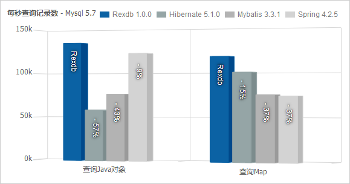

----------

# 
简介
 #

<!--
summary		概述
feature		功能
advantage	特点和优势
website		官方网站
help		帮助和支持
lisence		使用协议
-->

## 
概述
 ##

Rexdb是一款使用Java语言编写的，开放源代码的持久层框架。提供了查询、调用、（JTA）事务、数据源管理等功能，可以取代Mybatis、Hibernate作为系统的核心ORM框架。

Rexdb提供了工具类风格的接口，并且不需要编写配置，使用极为简便；同时，它还具备同类框架中最高效的执行效率。

## 性能 ##

更详细的性能测试请浏览官方网站中的[http://db.rex-soft.org/performance.php](http://db.rex-soft.org/performance.php)。

## 
功能
 ##

- 数据库操作：查询、更新、批处理、调用、（JTA）事物等；
- ORM映射：支持数组、Map和任意Java对象；
- 数据源：内置连接池，支持第三方数据源和JNDI；
- 方言：自动分页，支持Oracle、DB2、SQL Server、Mysql、达梦等数据库；
- 高级功能：监听、国际化、异常管理等；

## 
特点
 ##

- 高性能；
- 类似工具类的接口设计，使用简便，会写SQL即可；
- 免配置（数据源和全局配置除外）；

## 
官方网站
 ##

Rexdb的网站地址是：[http://db.rex-soft.org](http://db.rex-soft.org)。

## 
帮助和支持
 ##

Rexdb是免费的开源软件，限于资源条件，除文档、源代码和示例外，不提供日常的技术支持。但提供了[BUG反馈和建议](http://db.rex-soft.org/feedback.php)通道，您可以将BUG和改进建议反馈给我们。

## 
用户协议
 ##

Rexdb基于Apache 2.0协议，可以免费用于个人或商业用途。

协议详情请见：[Apache Lisence, Version 2.0](http://www.apache.org/licenses/LICENSE-2.0.html)