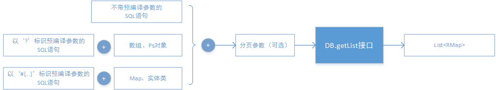
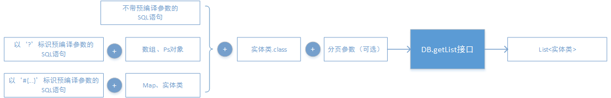
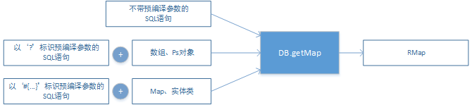
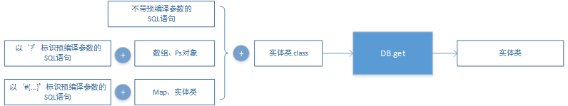
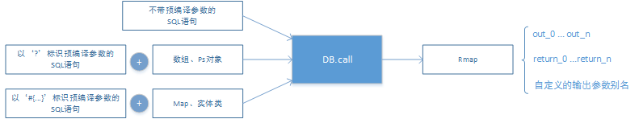

# 快速入门 #

本文档可以帮助您在最短的时间内了解Rexdb的使用方法。

## 目录 ##

- [准备运行环境](#user-content-c1)
- [全局配置文件](#user-content-c2)
- [创建一个测试表](#user-content-c3)
- [执行插入/更新/删除SQL](#user-content-c4)
- [执行批量更新](#user-content-c5)
- [查询多行记录](#user-content-c6)
- [查询单行记录](#user-content-c7)
- [启用事物](#user-content-c8)
- [调用函数和存储过程](#user-content-c9)
- [定义多个数据源](#user-content-c10)
- [使用其它数据源或JNDI](#user-content-c11)
- [更多功能](#user-content-c12)
- [附录：Rexdb可选配的第三方包](#user-content-c13)

## <div id="c1">准备运行环境</div> ##

Rexdb的运行环境需要满足以下要求：

1. JDK1.5及以上版本
2. 支持JDBC驱动

首先，请安装好数据库，并获取相应的jdbc驱动包，然后将Rexdb的Jar包，以及数据库的jdbc驱动包拷贝至环境变量classpath中。

以Mysql为例，这时您的classpath中应有以下2个jar包：
> rexdb-1.0.0.jar（或更高版本）
> mysql-connector-java-5.1.26-bin.jar（或其它版本的驱动）

您还可以在classpath中增加其它Jar包，以启用Rexdb的更多功能。例如，当增加Apache Log4j后，Rexdb可以自动启用日志功能，并使用Log4j记录日志；当增加Jboss javassist包后，可以启用Rexdb的动态字节码功能，以获取更高的查询性能。详情请参见[附录：Rexdb可选配的第三方包](#f1)。

准备就绪后，就可以使用Rexdb操作数据库了。本文档如无特殊说明，均以Mysql为例。

## <div id="c2">全局配置文件</div> ##
首先需要为Rexdb创建全局配置文件。Rexdb在初始化时会加载该文件，并根据配置的内容创建连接池、方言、日志、监听等。

在classpath目录中新建一个文件，名称为**rexdb.xml**，内容为（请将方括号及其内容替换为正确的值）：
```xml
<?xml version="1.0" encoding="UTF-8"?> 
<!DOCTYPE configuration PUBLIC "-//rex-soft.org//REXDB DTD 1.0//EN" "http://www.rex-soft.org/dtd/rexdb-1-config.dtd">
<configuration>
	<dataSource>
		<property name="driverClassName" value="[数据库驱动]" />
		<property name="url" value="[JDBC URL]" />
		<property name="username" value="[数据库账户]" />
		<property name="password" value="[数据库密码]" />
	</dataSource>
</configuration>
```
以Mysql为例，该配置文件的内容可能会是：
```xml
<?xml version="1.0" encoding="UTF-8"?> 
<!DOCTYPE configuration PUBLIC "-//rex-soft.org//REXDB DTD 1.0//EN" "http://www.rex-soft.org/dtd/rexdb-1-config.dtd">
<configuration>
	<dataSource>
		<property name="driverClassName" value="com.mysql.jdbc.Driver" />
		<property name="url" value="jdbc:mysql://localhost:3306/rexdb" />
		<property name="username" value="root" />
		<property name="password" value="12345678" />
	</dataSource>
</configuration>
```
请确保配置文件的名称为**rexdb.xml**，并存储在环境变量classpath的根目录中。如果您希望放置在其它目录，则需要手动调用Rexdb的初始化接口，以完成加载工作。详情请参考[Rexdb用户手册](http://#)。

## <div id="c3">创建一个测试表</div> ##

为了便于后续接口的展示，首先使用Rexdb创建一个表*REX_TEST*，该表包含3个字段：

> **ID** int(11) NOT NULL
> **NAME** varchar(30) NOT NULL
> **CREATE_TIME** time NOT NULL

编写一个Java类，名称为**TestCreate.java**，内容如下：
```java
import org.rex.DB;
import org.rex.db.exception.DBException;

public class TestCreate {
	public static void main(String[] args) throws DBException {
		String sql = "CREATE TABLE REX_TEST (ID int(11) NOT NULL, NAME varchar(30) NOT NULL, CREATE_TIME time NOT NULL)";
		DB.update(sql);
		System.out.println("table created.");
	}
}
```
*org.rex.db.DB*类是Rexdb的对外接口类，它提供了查询、更新、调用、事物等操作接口。*DB.update(String sql)*是该类的一个静态方法，用于在数据库中执行一个插入/更新/删除的SQL语句。

接下来使用命令行编译并执行该类：

    javac TestCreate.java
	java TestCreate

如果一切顺利，控制台将输出以下语句。

    table created.

此时，使用查询工具连接数据库，可以确认表*REX_TABLE*已被创建。

需要注意的是，如果数据库的配置有误，如地址无法连接、密码错误等。在执行该类时，将会有若干秒的等待，之后才会输出错误信息。这是由于Rexdb内置的连接池具有重试机制，会在一定间隔内，反复尝试几次连接，全部失败后才会抛出异常。这是连接池的容错策略，是正常现象。

## <div id="c4">执行插入/更新/删除SQL</div> ##

在Rexdb中，数据库的插入/更新/删除操作使用的是同一个接口。接下来以插入为例，演示接口的使用方法。

编写类**TestUpdate**，内容如下：
```Java
import java.util.Date;

import org.rex.DB;
import org.rex.db.exception.DBException;

public class TestUpdate {
	public static void main(String[] args) throws DBException {
		String sql = "INSERT INTO REX_TEST(ID, NAME, CREATE_TIME) VALUES (?, ?, ?)";
		int i = DB.update(sql, new Object[]{1, "test", new Date()});
		System.out.println( i + " row inserted.");
	}
}
```
DB.update(String sql, Object[] parameterArray)方法用于执行一个带有预编译参数的插入/更新/删除SQL。其中，parameterArray参数是一个数组，数组中的元素按照顺序对应SQL语句中的“?”标记。Rexdb将按照顺序从数组中取值，并调用JDBC相关接口赋值，然后执行SQL。

编译并执行该类后，控制台将输出：

    1 row inserted.

除Object[]数组可以作为执行SQL的参数外，Rexdb还内置了一个类*org.rex.db.Ps*，它拥有丰富的操作接口，可以用于封装预编译参数。它可以指定字段类型、按照下标赋值，还可以为存储过程调用声明输出、输入输出参数，您可以根据实际情况选用。除此之外，Rexdb还支持Map和自定义的Java实体类作为执行SQL的参数。

除数组外，各种类型的参数调用示例如下：

1）使用内置的*org.rex.db.Ps*类作为预编译参数：
```Java
String sql = "INSERT INTO REX_TEST(ID, NAME, CREATE_TIME) VALUES (?, ?, ?)";
int i = DB.update(sql, new Ps(1, "test", new Date()));
```

2）使用*Map*作为预编译参数：
```Java
String sql = "INSERT INTO REX_TEST(ID, NAME, CREATE_TIME) VALUES (#{id}, #{name}, #{createTime})";
Map prameters = new HashMap();
prameters.put("id", 1);
prameters.put("name", "test");
prameters.put("createTime", new Date());

int i = DB.update(sql, prameters);
```
3）使用实体类作为预编译参数。首先需要编写一个表*REX_TEST*对应的实体类：
```Java
import java.util.Date;

public class RexTest {
	
	private int id;
	private String name;
	private Date createTime;

	public RexTest() {
	}    

	public RexTest(int id, String name, Date createTime) {
		this.id = id;
		this.name = name;
		this.createTime = createTime;
	}

	public int getId() {
		return id;
	}

	public void setId(int id) {
		this.id = id;
	}

	public String getName() {
		return name;
	}

	public void setName(String name) {
		this.name = name;
	}

	public Date getCreateTime() {
		return createTime;
	}

	public void setCreateTime(Date createTime) {
		this.createTime = createTime;
	}
}
```
然后使用该类作为执行SQL的参数：
```Java
String sql = "INSERT INTO REX_TEST(ID, NAME, CREATE_TIME) VALUES (#{id}, #{name}, #{createTime})";
RexTest rexTest = new RexTest(1, "test", new Date());

int i = DB.update(sql, rexTest);
```
请注意，在使用Map类、Java实体类作为预编译参数时，SQL语句中的预编译参数标记不再是JDBC标准的“?”，而是被“#{*参数名称*}”取代，Rexdb在执行时，会根据标记中的*参数名称*查找Map、实体类中对应的属性值。其中，数据库字段名称和Java对象参数名称对应规则如下所示：

    数据库字段名称		Map.Entry.key、实体类属性名称
	ID					id
	NAME				name
	CREATE_TIME			createTime

还需要额外注意的是，在使用实体类作为预编译参数时，实体类**必须**满足如下条件，才能被Rexdb正常调用：

- 类是可以访问的
- 可以使用无参的构造函数创建类实例（启用动态字节码选项时需要调用）
- 参数需要有标准的getter方法

为便于描述，我们总结了*DB.update*接口中SQL和参数的组合方式，如下图所示：


## <div id="c5">执行批量更新</div> ##

当同时插入/更新/删除多行记录时，使用批量更新接口可以获得更高的执行效率。

编写类TestUpdateBatch，内容如下：
```Java
import java.util.Date;

import org.rex.DB;
import org.rex.db.Ps;
import org.rex.db.exception.DBException;

public class TestUpdateBatch {
	public static void main(String[] args) throws DBException {
		String sql = "INSERT INTO REX_TEST(ID, NAME, CREATE_TIME) VALUES (?, ?, ?)";
		Ps[] pss = new Ps[10];
		for (int i = 0; i < 10; i++)
			pss[i] = new Ps(i, "name", new Date());
		DB.batchUpdate(sql, pss);
	}
}
```
在上面的类中，以*org.rex.db.Ps*数组作为批量插入的参数，数组中的每个元素都代表一条记录。执行后*DB.batchUpdate(String sql, Ps[] pss)*，数据库将写入10条记录。

除*Ps*数组外，Rexdb还支持*Object*二维数组、*Map*数组、实体类数组以及*List*作为参数，或者直接执行多条SQL语句。使用不同类型的参数时，对应的SQL的写法与单条记录的插入/更新/删除相同，SQL语句和参数的组合关系如图所示：


## <div id="c6">查询多行记录</div> ##

编写类**TestQuery**，该类用于查询出表*REX_TEST*中的所有记录：
```Java
import java.util.List;

import org.rex.DB;
import org.rex.RMap;
import org.rex.db.exception.DBException;

public class TestQuery {
	public static void main(String[] args) throws DBException {
		String sql = "SELECT * FROM REX_TEST";
		List<RMap> list = DB.getMapList(sql);
		System.out.println(list);
	}
}
```
编译并执行后，输出结果如下：

    [{id=1, createTime=Tue Feb 16 15:05:54 CST 2016, name=test}, {id=1, createTime=Tue Feb 16 15:06:15 CST 2016, name=test}, {id=1, createTime=Tue Feb 16 15:13:41 CST 2016, name=test}]

*DB.getMapList(String sql)*方法用于执行查询SQL，并返回一个包含有查询结果的*List*，其中数据库列名将被转换为Java命名风格。

其中，*List*中的元素*org.rex.RMap*是Rexdb框架提供的封装类，它继承自*java.util.HashMap*，额外提供了Java类型的自动转换功能，您可以方便的从该类中直接获取各种Java类型的值，例如直接获取*int*类型、*String*类型，或者*java.util.Date*类型的值，而不需要自行编写类型转换代码。

如果您希望查询出实体类列表，可以使用如下代码：
```Java
String sql = "SELECT * FROM REX_TEST";
List<RexTest> list = DB.getList(sql, RexTest.class);
```
如果您希望查询出符合条件的实体类，可以使用如下代码（以数组做参数为例）：
```Java
String sql = "SELECT * FROM REX_TEST limit ?";
RexTest rexTest = DB.get(sql, new Object[] { 1 }, RexTest.class);
```
如果您希望执行分页查询，并查询出实体类，可以使用如下代码：
```Java
String sql = "SELECT * FROM REX_TEST";
List<RexTest> list = DB.getList(sql, RexTest.class, 1, 1);
```
接口*DB.getList(String sql, Class resultClass, int offset, int rows)*根据预设的offset和rows参数查询相应的数据库记录，offset参数表示行偏移，rows参数表示要查询的行数。Rexdb在执行查询时，会根据数据库类型自动选择相应的方言，再根据方言对SQL进行封装。例如，Mysql中，实际执行的SQL语句为：
```sql
SELECT * FROM REX_TEST limit ?, ?
```
Rexdb已经内置了如下数据库方言：

- DB2
- Derby
- DM
- H2
- HSQL
- MySQL
- Oracle
- PostgreSQL
- SQLServer

如果您当前使用的数据库不在列表中，可以自行实现一个方言类，并在全局配置文件的数据源配置中时指定方言。详情请查看Rexdb用户手册。

除示例中展示的接口外，Rexdb还提供了丰富的接口，可以应对各种使用场景。接口组合设置如下所示。

1）如果您没有编写结果集对应的实体类，可以使用图示中的参数组合，调用*DB.getMapList*查询出包含RMap的*List*对象：



2）如果您已经编写了结果集对应的实体类，则只需要在上述接口中增加一个*实体类.class*参数，并调用*DB.getList*查询出包含实体类的*List*对象，如图所示：



## <div id="c7">查询单行记录</div> ##

Rexdb提供了一系列查询单行记录的接口，例如，如果您希望只查询一行记录，并获取实体类时，可以使用如下接口：
```Java
String sql = "SELECT * FROM REX_TEST limit 1";
RexTest rexTest = DB.get(sql, RexTest.class);
```
当没有编写与结果集对应的实体类时，则可以直接查询出一个*RMap*对象：
```Java
String sql = "SELECT * FROM REX_TEST limit 1";
RMap rexTest = DB.getMap(sql);
```
如果希望直接获取某一行中的某个字段值时，可以直接从*RMap*中取值。例如查询某张表的总记录数，可以直接调用*RMap.getInt(String key)*接口，以获取int类型的值。这可以节省您的代码量。但是请确保能够查询出记录，以防产生空指针异常。例如：
```Java
String sql = "SELECT count(*) as COUNT FROM REX_TEST";
int count = DB.getMap(sql).getInt("count");
```
在调用单行记录查询接口时，您需要确保SQL只能查询出0条或者1条结果。当查询出的记录数超过1行时，Rexdb无法确定您需要哪一行记录，将会抛出异常信息。

单行记录查询接口的SQL和参数组合设置如下：

1）如果您没有编写结果集对应的实体类，可以调用*DB.getMap*接口查询RMap对象：



2）如果您已经编写了结果集对应的实体类，则只需要在上述接口中增加一个*实体类.class*参数，并调用*DB.get*接口查询实体类的实例，如图所示：



## <div id="c8">启用事物</div> ##

编写类TestTransaction，内容如下：
```Java
import java.util.Date;

import org.rex.DB;
import org.rex.db.Ps;
import org.rex.db.exception.DBException;

public class TestTransaction {
	public static void main(String[] args) throws DBException {
		String sql = "INSERT INTO REX_TEST(ID, NAME, CREATE_TIME) VALUES (?, ?, ?)";
		DB.beginTransaction();
		try{
			DB.update(sql, new Ps(1, "test", new Date()));
			DB.update(sql, new Ps(2, "test", new Date()));
			DB.commit();
		}catch(Exception e){
			DB.rollback();
		}
	}
}
```
接口*DB.beginTransaction()*用于开启一个事物，*DB.commit()*和*DB.rollback()*分别用于提交和回滚事物。Rexdb的事物是线程级别的，事物一旦开启，将在整个用户线程中有效，直到事物被提交或者回滚。

如果需要Jta事物，请使用如下接口：
```Java
DB.beginJtaTransaction();
DB.rollbackJta();
DB.commitJta();
```
## <div id="c9">调用函数和存储过程</div> ##

Rexdb支持函数和存储过程调用，可以处理函数或存储过程中的输入、输出、输入输出参数和返回结果。

例如，Mysql中有如下存储过程：
```sql
CREATE PROCEDURE `proc` ()  BEGIN
	--do something
END$$
```
则可以使用Rexdb的*DB.call(String sql)*接口调用该存储过程：
```java
DB.call("{call proc_in()}");
```
当存储过程有输入参数时，例如：
```sql
CREATE PROCEDURE `proc_in` (IN `id` INT)  BEGIN
	--do something
END$$
```
则可以使用*Object*数组、*Map*、*Ps*对象、实体类等作为输入参数。例如，以以*Ps*对象做参数时：
```java
RMap result = DB.call("{call proc_in(?)}", new Ps(1));
```
当存储过程定义了输出参数时，则需要使用*org.rex.db.Ps*对象声明该参数。例如，Mysql中有如下存储过程：
```sql
CREATE PROCEDURE `proc_in_out` (IN `i` INT, OUT `s` INT)  
BEGIN 
	--do something
END$$
```
在调用存储过程时，需要使用*Ps*对象声明输出参数的位置和类型。存储过程在调用后，将返回一个*RMap*对象，在该对象中可以获取输出参数的值：
```java
Ps ps = new Ps();
ps.add(0);
ps.addOutInt();//声明为输出参数

RMap result = DB.call(sql, ps);
```
在返回的*RMap*对象中，输出参数的键为“*out_参数序号*”。为方便调用后取值，也可以在声明输出参数时设置一个别名，例如：
```java
ps2.addInOut("name", 1);//将第1个参数声明为输入输出参数，且别名为name
```
有返回值的存储过程，在调用后也会被解析并转换为Java对象，并封装在返回的*RMap*对象中，且键为“*result_返回值序号*”。



## <div id="c10">定义多个数据源</div> ##

如果您的应用程序需要使用多个数据库，可以在Rexdb全局配置文件**rexdb.xml**中配置多个数据源，例如：
```xml
<?xml version="1.0" encoding="UTF-8"?> 
<!DOCTYPE configuration PUBLIC "-//rex-soft.org//REXDB DTD 1.0//EN" "http://www.rex-soft.org/dtd/rexdb-1-config.dtd">
<configuration>
	<dataSource>
		<property name="driverClassName" value="com.mysql.jdbc.Driver" />
		<property name="url" value="jdbc:mysql://localhost:3306/rexdb" />
		<property name="username" value="root" />
		<property name="password" value="12345678" />
	</dataSource>
	<dataSource id="oracleDs">
		<property name="driverClassName" value="oracle.jdbc.driver.OracleDriver" />
		<property name="url" value="jdbc:oracle:thin:@127.0.0.1:1521:orcl" />
		<property name="username" value="rexdb" />
		<property name="password" value="12345678" />
	</dataSource>
</configuration>
```
上面的配置文件定义了2个数据源，分别是Mysql和Oracle数据库。其中，Oracle数据源定义了*id="oracleDs"*的属性，在调用*org.rex.db.DB*的接口时，可以通过首个参数指定该数据源。未定义*id*属性的是Rexdb的默认数据源，一个应用中只能定义1个默认数据源。

在调用接口时，可以指定数据源，例如：
```java
String sql = "SELECT 1 FROM DUAL";
RMap map = DB.getMap("oracleDs", sql);
```
*org.rex.db.DB*类的更新、查询、调用、事物等接口均可以指定数据源，只需要将接口的第一个参数设置为配置文件中声明的*id*值即可。

## <div id="c11">使用其它数据源或JNDI</div> ##

Rexdb内置了连接池和数据源，默认情况下使用的是默认数据源。如果您希望使用其它数据源，例如DBCP、C3P0等，可以在配置文件中进行如下定义：
```xml
<?xml version="1.0" encoding="UTF-8"?> 
<!DOCTYPE configuration PUBLIC "-//rex-soft.org//REXDB DTD 1.0//EN" "http://www.rex-soft.org/dtd/rexdb-1-config.dtd">
<configuration>
	<dataSource class="org.apache.commons.dbcp.BasicDataSource">
		<property name="driverClassName" value="com.mysql.jdbc.Driver" />
		<property name="url" value="jdbc:mysql://localhost:3306/rexdb" />
		<property name="username" value="root" />
		<property name="password" value="12345678" />
	</dataSource>
</configuration>
```
全局配置文件的“/configuration/dataSource”节点*class="org.apache.commons.dbcp.BasicDataSource"*属性定义了数据源的实现类，其子节点*property*用于配置数据源需要的属性。Rexdb在初始化时，会首先创建数据源实例，然后调用其setter方法赋值。

如果您希望使用JNDI，则可以进行如下配置：
```xml
<?xml version="1.0" encoding="UTF-8"?> 
<!DOCTYPE configuration PUBLIC "-//rex-soft.org//REXDB DTD 1.0//EN" "http://www.rex-soft.org/dtd/rexdb-1-config.dtd">
<configuration>
	<dataSource jndi="java:comp/env/mysqlJNDI"/>
</configuration>
```
其中，JNDI的定义格式可能会因应用所在的容器而有所不同，如果出现找不到JNDI的错误时，请检查容器的名称定义规则。

## <div id="c12">更多功能</div> ##

除本文档中提及的功能外，Rexdb还有更多用法和设置选项，详情请参见Rexb用户手册。

## <div id="f1">附录：Rexdb可选配的第三方包</div> ##

Rexdb没有必须依赖的第三方包，但在运行环境中导入如下第三方包后，可以启用更多功能：

- 日志包：可以选用Apache log4j、slf4j、Apache log4j2。当Rexdb在初始化时，检测到运行环境中存在以上jar包时，将自动开启日志功能。当运行环境中存在多种日志包时，Rexdb会按照顺序优先选择第1个日志服务。
- 连接池：Rexdb内置了一个连接池，同时也支持DBCP、C3P0等连接池，以及JNDI数据源。
- 动态字节码：Rexdb支持javassist的动态字节码功能，当运行环境中具有javassist的Jar包，并且启用了相关配置时，Rexdb将使用动态字节码方式读写Java对象，此时，调用*DB.get*接口和*DB.getList*接口时，将会获得更高效的性能。