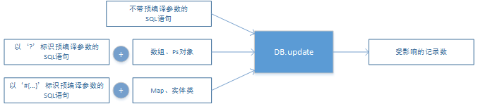
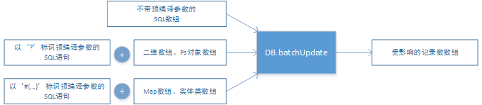

<style type="text/css">
	table {
		font-family: verdana,arial,sans-serif;
		font-size:12px;
		color:#333333;
		border-width: 1px;
		border-color: #666666;
		border-collapse: collapse;
		width: 100%;
	}
	table th {
		border-width: 1px;
		padding: 8px;
		border-style: solid;
		border-color: #666666;
		background-color: #dedede;
	}
	table td {
		border-width: 1px;
		padding: 8px;
		border-style: solid;
		border-color: #666666;
		background-color: #ffffff;
	}
</style>

# 用户手册 #

## 概述 ##
### 简介 ###

Rexdb是一款使用Java语言编写的，开放源代码的持久层框架。它具有管理数据源、执行SQL、调用函数和存储过程、处理事务等功能。Rexdb不需要像JDBC一样编写繁琐的代码，也不需要编写映射文件，只要将SQL和Java对象等参数传递至框架接口，即可获取需要的结果。

Rexdb的官方网站地址为：[http://db.rex-soft.org](http://db.rex-soft.org)

### 功能 ###

Rexdb具有如下功能：

- 数据库查询、更新、批量处理、调用、事物和JTA事物等，支持`Java数组`、`Map`、`自定义的Java对象`作为预编译参数；
- O/R映射，自动将结果集转换为`Map`、`Java对象`；
- 数据源管理，拥有内置的连接池和数据源，支持第三方数据源和JNDI；
- 数据库方言，自动封装分页查询和常用函数，支持`Oracle`、`DB2`、`SQL Server`、`Mysql`、`达梦`等数据库；
- 支持对框架初始化、SQL执行、事物等事件的监听；
- 统一的异常管理、异常信息的国际化支持等；

## 开发环境配置 ##

Rexdb的官方网站提供了下载衔接，下载并解压后，可以得到编译好的jar包和全局配置文件的示例：

- rexdb-1.0.0.jar（或其它版本）
- rexdb.xml

**rexdb-1.0.0.jar**（或其它版本）是运行Rexdb必须的包，请确保它在开发/运行环境的`classpath`中。由于Rexdb直接调用JDBC的接口，所以您还需要在`classpath`中设置好待连接数据库的驱动。如果要使用Rexdb的扩展功能，还需在运行环境中增加其它jar包。具体请参考[扩展](http://#)。

**rexdb.xml**是Rexdb的全局配置文件，默认需要放置在开发/运行环境的`classpath`中。如果需要放置在其它位置，需要编写程序加载指定位置的文件。具体请参考[全局配置文件-加载配置](http://#)。

例如，在JavaEE Web应用中，**rexdb-1.0.0.jar**（或其它版本）应当放置在应用根目录下的“`/WEB-INF/lib`”文件夹中，**rexdb.xml**默认应当放置在“`/WEB-INF/classes`”中。


## 全局配置文件 ##

Rexdb需要一个全局配置文件**rexdb.xml**，用于设置运行选项、配置数据源、监听程序等。该文件是XML格式，各节点的含义如下：

- `/configuration`：根节点；
- `/configuration/properties`：外部资源文件，可以在该文件中定义`key-value`对，并在其余配置中以“`${key}`”的格式引用`value`；
- `/configuration/settings`：全局设置选项，用于配置Rexdb的全局选项，例如异常信息语言、日志、反射缓存等；
- `/configuration/dataSource`：数据源配置；
- `/configuration/listener`：监听程序配置，可以使用监听程序跟踪SQL执行、事物等事件。

例如，某应用中的**rexdb.xml**文件内容如下：

```xml

	<?xml version="1.0" encoding="UTF-8"?> 
	<!DOCTYPE configuration PUBLIC "-//rex-soft.org//REXDB DTD 1.0//EN" "http://www.rex-soft.org/dtd/rexdb-1-config.dtd">
	<configuration>
		<properties path="rexdb-settings.properties" />
		<settings>
			<property name="lang" value="${setting.lang}"/>
			<property name="nolog" value="true" />
			<property name="reflectCache" value="true" />
			<property name="dynamicClass" value="true" />
		</settings>
		<dataSource>
			<property name="driverClassName" value="com.mysql.jdbc.Driver" />
			<property name="url" value="jdbc:mysql://localhost:3306/rexdb" />
			<property name="username" value="root" />
			<property name="password" value="12345678" />
		</dataSource>
		<dataSource id="oracleDs" jndi="java:/comp/env/oracleDb"/>
	 	<listener class="org.rex.db.listener.impl.SqlDebugListener"/> 
	</configuration>
```

配置文件中引用了一个外部资源文件**rexdb-settings.properties**，并设置了异常信息语言、禁用了日志输出等全局选项；配置了一个默认数据源和一个`oracleDs`数据源；启用了Rexdb内置的`SqlDebugListener`监听。各节点的详细含义和配置方法请参见下面的章节。

### 加载配置文件 ###

**rexdb.xml**的默认存放路径是运行环境的`classpath`根目录。Rexdb会在类加载时自动读取该文件，并完成框架的初始化工作。如果您启用了日志，将在日志输出中看到类似如下内容（输出格式取决于您的日志配置）：

```bash
    [INFO][2016-02-23 21:26:55] configuration.Configuration[main] - loading default configuration rexdb.xml.
	... # detailed log messages.
	[INFO][2016-02-23 21:26:59] configuration.Configuration[main] - default configuration rexdb.xml loaded.
```

当在默认路径中无法找到**rexdb.xml**文件时，会输出如下日志：

```bash
	[INFO][2016-02-23 22:18:36] configuration.Configuration[main] - loading default configuration rexdb.xml.
	[WARN][2016-02-23 22:18:36] configuration.Configuration[main] - could not load default configuration rexdb.xml from classpath, rexdb is not initialized, cause (DB-URS01) resource rexdb.xml not found.
```

在配置未被加载时调用Rexdb的接口，Rexdb会再次尝试从默认路径中加载配置，如果仍然无法加载，将会抛出异常信息。如果Rexdb的全局配置文件放置在其它位置，或者使用了其它的命名，可以使用类[org.rex.db.configuration.Configuration](#class-Configuration)类加载指定目录下的配置文件。该类有如下加载配置文件的接口：

<table class="tbl">
	<tr>
		<th width="60">返回值</th>
		<th width="300">接口</th>
		<th width="">说明</th>
	</tr>
	<tr>
		<td>void</td>
		<td>loadDefaultConfiguration()</td>
		<td>从classpath中加载名称为rexdb.xml的配置文件</td>
	</tr>
	<tr>
		<td>void</td>
		<td>loadConfigurationFromClasspath(String path)</td>
		<td>从classpath中加载配置文件</td>
	</tr>
	<tr>
		<td>void</td>
		<td>loadConfigurationFromFileSystem(String path)</td>
		<td>从文件系统中加载配置文件</td>
	</tr>
</table>

例如，下面的代码加载了位于classpath中的rexdb-config.xml文件：

```java
    Configuration.loadConfigurationFromClasspath("rexdb-config.xml");
```

需要注意到是，Rexdb在加载配置文件时具备容错机制，当某节点不符合配置要求，或无法根据配置完成初始化时，该节点将会被忽略，并继续加载下一个节点。所以，您通常需要留意日志的输出，检查是否有未被成功加载的配置。

### 外部资源文件 ###

全局配置文件的*/configuration/properties*节点用于引用一个外部资源文件，在该文件中定义的`key-value`配置可以被其它节点以`${key}`的格式引用。该节点有如下可选属性：

<table>
	<tr>
		<th width="60">属性</th>
		<th width="40">必填</th>
		<th width="40">类型</th>
		<th width="">说明</th>
	</tr>
	<tr>
		<td>path</td>
		<td>否</td>
		<td>String</td>
		<td>本地classpath中资源文件的相对路径，不能与*url*属性同时存在。</td>
	</tr>
	<tr>
		<td>url</td>
		<td>否</td>
		<td>String</td>
		<td>网络中资源文件的URL路径，不能与*path*属性同时存在。</td>
	</tr>
</table>

例如，放置在`classpath`根目录的资源文件**rexdb-database-sample.properties**内容如下：

```bash
	driver=com.mysql.jdbc.Driver
	url=jdbc:mysql://localhost:3306/rexdb
	username=root
	password=12345678
```

**rexdb.xml**中的配置如下：

```xml
	<?xml version="1.0" encoding="UTF-8"?> 
	<!DOCTYPE configuration PUBLIC "-//rex-soft.org//REXDB DTD 1.0//EN" "http://www.rex-soft.org/dtd/rexdb-1-config.dtd">
	<configuration>
		<properties path="rexdb-database-sample.propertie" />
		<dataSource>
			<property name="driverClassName" value="${driver}" />
			<property name="url" value="${url}" />
			<property name="username" value="${username}" />
			<property name="password" value="${password}" />
		</dataSource>
	</configuration>
```

Rexdb在初始化时会首先读取**rexdb-database-sample.properties**文件的内容。在解析**rexdb.xml**时，如果发现其内容符合`${...}`的格式，则会替换为资源文件中配置的值。在上面的示例中，`dataSource`节点的属性`driverClassName`的值是`${driver}`，则会被替换为资源文件中`driver`对应的值`com.mysql.jdbc.Driver`。

### 全局设置 ###

全局配置文件的`/configuration/settings`节点用于设置Rexdb的运行参数，可用的配置选项有：

<table>
	<tr>
		<th width="60">配置项</th>
		<th width="40">必填</th>
		<th width="40">类型</th>
		<th width="100">可选值</th>
		<th width="60">默认值</th>
		<th width="">说明</th>
	</tr>
	<tr>
		<td><code>lang</code></td>
		<td>否</td>
		<td><code>String</code></td>
		<td><code>en</code>, <code>zh-cn</code></td>
		<td><code>en</code></td>
		<td>设置Rexdb异常信息的语言。要注意的是，在Linux系统中，中文异常信息在输出至控制台可能会出现乱码。</td>
	</tr>
	<tr>
		<td><code>nolog</code></td>
		<td>否</td>
		<td><code>boolean</code></td>
		<td><code>true</code>, <code>false</code></td>
		<td><code>false</code></td>
		<td>是否禁用所有日志输出，当设置为<code>true</code>时，Rexdb将不再输出任何日志。</td>
	</tr>
	<tr>
		<td><code>validateSql</code></td>
		<td>否</td>
		<td><code>boolean</code></td>
		<td><code>true</code>, <code>false</code></td>
		<td><code>false</code></td>
		<td>是否对SQL语句进行简单的校验。通常Rexdb只校验SQL中带有<code>?</code>标记的个数是否与的预编译参数个数相同。</td>
	</tr>
	<tr>
		<td><code>checkWarnings</code></td>
		<td>否</td>
		<td><code>boolean</code></td>
		<td><code>true</code>, <code>false</code></td>
		<td><code>false</code></td>
		<td>在执行SQL后，是否检查状态中的警告。当设置为<code>true</code>时，将执行检查，当发现警告信息时抛出异常。要注意的是，开启该选项可能会大幅降低Rexdb的性能。</td>
	</tr>
	<tr>
		<td><code>queryTimeout</code></td>
		<td>否</td>
		<td><code>int</code></td>
		<td>任意整数</td>
		<td><code>-1</code></td>
		<td>执行SQL的超时秒数，当小于或等于0时，不设置超时时间。当同时设置了事物超时时间时，Rexdb会自动选择一个较短的时间作为执行SQL的超时秒数。</td>
	</tr>
	<tr>
		<td><code>transactionTimeout</code></td>
		<td>否</td>
		<td><code>int</code></td>
		<td>任意整数</td>
		<td><code>-1</code></td>
		<td>执行事务的超时秒数，当小于或等于0时，不设置超时时间。要注意的是，Rexdb通过设置事物中每个SQL的执行时间来控制整体事物的时间，如果事物中有与SQL执行无关的操作，且在执行该操作时超时，事物超时时间将不起作用。</td>
	</tr>
	<tr>
		<td><code>transactionIsolation</code></td>
		<td>否</td>
		<td>String</td>
		<td>
			<code>DEFAULT</code><br/>
			<code>READ_UNCOMMITTED</code><br/>
			<code>READ_COMMITTED</code><br/>
			<code>REPEATABLE_READ</code><br/>
			<code>SERIALIZABLE</code><br/>
		</td>
		<td><code>DEFAULT</td>
		<td>
			定义事物的隔离级别，仅在非JTA事物中时有效。各参数含义如下：<br/>
			- <code>DEFAULT</code>：使用数据库默认的事务隔离级别；<br/>
			- <code>READ_UNCOMMITTED</code>：一个事务可以看到其它事务未提交的数据<br/>
			- <code>READ_COMMITTED</code>：一个事务修改的数据提交后才能被另外一个事务读取；<br/>
			- <code>REPEATABLE_READ</code>：同一事务的多个实例在并发读取数据时，会看到同样的数据行；<br/>
			- <code>SERIALIZABLE</code>：通过强制事务排序，使事物之间不可能相互冲突。
		</td>
	</tr>
	<tr>
		<td><code>autoRollback</code></td>
		<td>否</td>
		<td><code>boolean</code></td>
		<td><code>true</code>, <code>false</code></td>
		<td><code>false</code></td>
		<td>
			事务提交失败时是否自动回滚。
		</td>
	</tr>
	<tr>
		<td><code>reflectCache</code></td>
		<td>否</td>
		<td><code>boolean</code></td>
		<td><code>true</code>, <code>false</code></td>
		<td><code>true</code></td>
		<td>是否启用反射缓存。当启用时，Rexdb将会缓存类的参数、函数等信息。开启该选项可以大幅提升Rexdb的性能。</td>
	</tr>
	<tr>
		<td><code>dynamicClass</code></td>
		<td>否</td>
		<td><code>boolean</code></td>
		<td><code>true</code>, <code>false</code></td>
		<td><code>true</code></td>
		<td>是否启用动态字节码功能。当开启该选项时，Rexdb将使用javassist的生成中间类。启用该选项可以大幅提高Rexdb在查询<code>Java对象</code>时的性能。要注意的是，该选项需要配合jboss javassist包使用，Rexdb会在加载全局配置时检测javassist环境，当环境不可用时，该配置项会被自动切换为false。</td>
	</tr>
	<tr>
		<td><code>dateAdjust</code></td>
		<td>否</td>
		<td><code>boolean</code></td>
		<td><code>true</code>, <code>false</code></td>
		<td><code>true</code></td>
		<td>写入数据时，是否自动将日期类型的参数转换为<code>java.sql.Timestamp</code>类型。开启此选项可以有效避免日期、时间数据的丢失，以及因类型、格式不匹配而产生的异常。</td>
	</tr>
</table>

例如，如果要设置Rexdb抛出异常时的语言为中文，并且禁用日志，可以使用如下配置：

```xml
	<settings>
		<property name="lang" value="en"/>
		<property name="nolog" value="false" />
	</settings>
```

要注意的是，如果设置项不被Rexdb支持，或者值的格式、值域不正确，则该设置会被忽略并使用默认值。

### 数据源 ###

*/configuration/dataSource*节点用于配置数据源。该节点支持如下属性：

<table>
	<tr>
		<th width="60">属性</th>
		<th width="40">必填</th>
		<th width="40">类型</th>
		<th width="">说明</th>
	</tr>
	<tr>
		<td><code>id</code></td>
		<td>否</td>
		<td><code>String</code></td>
		<td>数据源编号。不设置时为Rexdb的默认数据源，配置文件中只允许出现一个默认数据源。</td>
	</tr>
	<tr>
		<td><code>class</code></td>
		<td>否</td>
		<td><code>String</code></td>
		<td>数据源实现类，不设置时使用Rexdb的内置数据源，不能与<code>jndi</code>属性一同出现。</td>
	</tr>
	<tr>
		<td><code>jndi</code></td>
		<td>否</td>
		<td><code>String</code></td>
		<td>上下文中的数据源JNDI，不能与<code>class</code>属性一同出现。</td>
	</tr>
	<tr>
		<td><code>dialect</code></td>
		<td>否</td>
		<td><code>String</code></td>
		<td>为该数据源指定的数据库方言，不设置时将由Rexdb根据元数据信息自动选择内置的方言，请参见[方言接口](#class-dialect)。</td>
	</tr>
</table>

也可以通过`property`节点为数据源初始化参数。当不设置`class`和`jndi`属性时，Rexdb将使用内置的数据源`org.rex.db.datasource.SimpleDataSource`。该数据源支持如下初始化参数：

<table class="tbl">
	<tr>
		<th width="60">选项</th>
		<th width="40">必填</th>
		<th width="60">类型</th>
		<th width="80">可选值</th>
		<th width="60">默认值</th>
		<th width="">说明</th>
	</tr>
	<tr>
		<td><code>driverClassName</code></td>
		<td>是</td>
		<td><code>String</code></td>
		<td>-</td>
		<td>-</td>
		<td>JDBC驱动类。</td>
	</tr>
	<tr>
		<td><code>url</code></td>
		<td>是</td>
		<td><code>String</code></td>
		<td>-</td>
		<td>-</td>
		<td>数据库连接URL。</td>
	</tr>
	<tr>
		<td><code>username</code></td>
		<td>是</td>
		<td><code>String</code></td>
		<td>-</td>
		<td>-</td>
		<td>数据库用户。</td>
	</tr>
	<tr>
		<td><code>password</code></td>
		<td>是</td>
		<td><code>String</code></td>
		<td>-</td>
		<td>-</td>
		<td>数据库密码。</td>
	</tr>
	<tr>
		<td><code>initSize</code></td>
		<td>否</td>
		<td><code>int</code></td>
		<td>大于0的整数</td>
		<td><code>1</code></td>
		<td>初始化连接池时创建的连接数。</td>
	</tr>
	<tr>
		<td><code>minSize</code></td>
		<td>否</td>
		<td><code>int</code></td>
		<td>大于0的整数</td>
		<td><code>3</code></td>
		<td>连接池保持的最小连接数。连接池将定期检查持有的连接数，达不到该数量时将开启新的空闲连接。</td>
	</tr>
	<tr>
		<td><code>maxSize</code></td>
		<td>否</td>
		<td><code>int</code></td>
		<td>大于0的整数</td>
		<td><code>10</code></td>
		<td>连接池的最大连接数。当程序所需连接超出此数量时，将置于等待状态，直到有新的空闲连接。</td>
	</tr>
	<tr>
		<td><code>increment</code></td>
		<td>否</td>
		<td><code>int</code></td>
		<td>大于0的整数</td>
		<td><code>1</code></td>
		<td>每次增长的连接数。当连接池的连接数量不足，需要开启新的连接时，将一次性增长该参数指定的连接数。</td>
	</tr>
	<tr>
		<td><code>retries</code></td>
		<td>否</td>
		<td><code>int</code></td>
		<td>大于0的整数</td>
		<td><code>2</code></td>
		<td>获取新的数据库连接失败后的重试次数。Rexdb不会判定失败原因，只要无法创建新的连接，即重试指定的次数。</td>
	</tr>
	<tr>
		<td><code>retryInterval</code></td>
		<td>否</td>
		<td><code>int</code></td>
		<td>大于0的整数</td>
		<td><code>750</code></td>
		<td>创建新的数据库连接失败后的重试间隔，单位为毫秒。即当获取一个新的数据库连接失败，直到下一次重试的等待时间.</td>
	</tr>
	<tr>
		<td><code>getConnectionTimeout</code></td>
		<td>否</td>
		<td><code>int</code></td>
		<td>大于0的整数</td>
		<td><code>5000</code></td>
		<td>获取连接的超时时间，单位为毫秒。当程序从Rexdb数据源中申请一个新的连接，且当前无空闲连接时，程序的等待时间。当超过改时间后，Rexdb会抛出一个超时的异常信息。</td>
	</tr>
	<tr>
		<td><code>inactiveTimeout</td>
		<td>否</td>
		<td><code>int</td>
		<td>大于0的整数</td>
		<td><code>600000</td>
		<td>数据库连接的最长空闲时间，单位为毫秒。当数据库连接的空闲时间超过该参数的值时，连接会被关闭。</td>
	</tr>
	<tr>
		<td><code>maxLifetime</code></td>
		<td>否</td>
		<td><code>int</code></td>
		<td>大于0的整数</td>
		<td><code>1800000</code></td>
		<td>数据库连接的最长时间，单位为毫秒。当数据库连接开启时间超过该参数的值时，连接会被关闭。</td>
	</tr>
	<tr>
		<td><code>testConnection</code></td>
		<td>否</td>
		<td><code>boolean</code></td>
		<td><code>true</code>, <code>false</code></td>
		<td><code>true</code></td>
		<td>开启新的数据库连接后，是否测试连接可用。当运行环境为JDK1.6及以上版本时，Rexdb将使用JDBC的测试接口执行测试；当JDK低于1.5时，如果未指定测试SQL，将调用方言接口获取测试SQL，如果能成功执行，则测试通过。</td>
	</tr>
	<tr>
		<td><code>testSql</code></td>
		<td>否</td>
		<td><code>String</code></td>
		<td>SQL语句</td>
		<td>-</td>
		<td>指定测试连接是否活跃的SQL语句。</td>
	</tr>
	<tr>
		<td><code>testTimeout</code></td>
		<td>否</td>
		<td><code>int</code></td>
		<td>大于0的整数</td>
		<td><code>500</code></td>
		<td>测试连接的超时时间。</td>
	</tr>
</table>

类似于Rexdb内置的数据源，其它开源数据源（例如Apache DBCP、C3P0等），通常也支持设置多个初始化参数，具体请参考各自的用户手册。

例如，以下代码配置了3个数据源：

```xml
	<dataSource>
		<property name="driverClassName" value="oracle.jdbc.driver.OracleDriver" />
		<property name="url" value="jdbc:oracle:thin:@127.0.0.1:1521:orcl" />
		<property name="username" value="test" />
		<property name="password" value="123456" />
	</dataSource>
	<dataSource id="mysqlDs" class="org.apache.commons.dbcp.BasicDataSource">
		<property name="driverClassName" value="com.mysql.jdbc.Driver" />
		<property name="url" value="jdbc:mysql://localhost:3306/rexdb" />
		<property name="username" value="root" />
		<property name="password" value="12345678" /
	</dataSource>
	<dataSource id="oracleDs" jndi="java:/comp/env/oracleDb"/>
```

按照顺序分别是：

- 连接Oracle数据库的默认数据源，使用Rexdb自带的数据源和连接池；
- 连接Mysql数据库的数据源，编号为“mysqlDs”，使用了Apache DBCP数据源；
- 连接Oracle的数据源，编号为“oracleDs”，使用JNDI方式查找容器自带的数据源；

上面的示例中，默认数据源使用了Rexdb自带的数据源，如果希望将其配置为初始化连接数为3、每次增长3个连接、重试次数设置为3、不再测试连接活跃性时，可以调整为如下配置：

```xml
	<dataSource>
		<property name="driverClassName" value="oracle.jdbc.driver.OracleDriver" />
		<property name="url" value="jdbc:oracle:thin:@127.0.0.1:1521:orcl" />
		<property name="username" value="test" />
		<property name="password" value="123456" />
		
		<property name="initSize" value="3"/>
		<property name="increment" value="3"/>
		<property name="retries" value="3"/>
		<property name="testConnection" value="false"/>
	</dataSource>
```

在配置好数据源后，在调用类`org.rex.DB`的方法执行SQL、处理事务时，可以指定数据源。例如，在执行查询时：

```java
	DB.getMap("SELECT * FROM REX_TEST");			//使用默认数据源执行查询
	DB.getMap("mysqlDs", "SELECT * FROM REX_TEST");	//使用mysqlDs数据源执行查询
	DB.getMap("oracleDs", "SELECT * FROM REX_TEST");//使用oracleDs数据源执行查询
```

### 监听 ###

*/configuration/listener*节点用于设置监听程序。监听程序可以跟踪SQL执行、事物等事件，该节点支持如下属性：

<table>
	<tr>
		<th width="60">属性</th>
		<th width="40">必填</th>
		<th width="40">类型</th>
		<th width="">说明</th>
	</tr>
	<tr>
		<td><code>class</code></td>
		<td>否</td>
		<td><code>String</code></td>
		<td>监听程序实现类。</td>
	</tr>
</table>

如果监听类定义了可以设置的属性，还可以通过设置`property`节点设置值。Rexdb内置了用于输出SQL和事物信息的监听类，分别是：

-` org.rex.db.listener.impl.SqlDebugListener`：使用日志接口输出SQL和事物信息。该监听类支持如下配置选项：

<table class="tbl">
	<tr>
		<th width="60">选项</th>
		<th width="40">必填</th>
		<th width="60">类型</th>
		<th width="80">可选值</th>
		<th width="60">默认值</th>
		<th width="">说明</th>
	</tr>
	<tr>
		<td><code>level</code></td>
		<td>否</td>
		<td><code>String</code></td>
		<td><code>debug</code>, <code>info</code></td>
		<td><code>debug</code></td>
		<td>设置日志的输出级别。</td>
	</tr>
	<tr>
		<td><code>simple</td>
		<td>否</td>
		<td><code>boolean</code></td>
		<td><code>true</code>, <code>false</code></td>
		<td><code>false</code></td>
		<td>是否启用简易的日志输出。当设置为<code>true</code>时，仅在SQL或事物完成后输出简要的日志；设置为<code>false</code>时，在SQL和事物执行前后均会输出日志。</td>
	</tr>
</table>

- `org.rex.db.listener.impl.SqlConsolePrinterListener`：将SQL和事物信息输出到`System.out`终端。该监听类支持如下配置选项：

<table class="tbl">
	<tr>
		<th width="60">选项</th>
		<th width="40">必填</th>
		<th width="60">类型</th>
		<th width="80">可选值</th>
		<th width="60">默认值</th>
		<th width="">说明</th>
	</tr>
	<tr>
		<td><code>simple</code></td>
		<td>否</td>
		<td><code>boolean</code></td>
		<td><code>true</code>, <code>false</code></td>
		<td><code>false</code></td>
		<td>是否启用简易的日志输出，当设置为<code>true</code>时，仅在SQL或事物完成后输出日志；设置为<code>false</code>时，在SQL和事物执行前后均会输出日志。</td>
	</tr>
</table>

例如，一下代码配置了一个监听：

```xml
 	<listener class="org.rex.db.listener.impl.SqlDebugListener">
 		<property name="simple" value="true"/>
 	</listener>
```

上面的配置使用了Rexdb内置的`SqlDebugListener`监听类，并以DEBUG级别输出简要的日志信息。如果您需要自行定义监听程序，例如记录每个SQL的执行时间，可以编写程序实现监听接口，详情请查看[扩展-监听](#class-listener)。

需要注意的是，监听程序并非线程安全，且不运行于独立线程，在编程时需要注意线程安全和性能问题。

## 执行数据库操作 ##

定义好全局配置文件后，就可以执行数据库操作了。Rexdb将数据库操作接口集中在类`org.rex.DB`中，且都是静态的，可以直接调用。根据SQL类型的不同，可以将接口分类如下：
    
- 插入/更新/删除操作：`DB.update(...)`系列接口；
- 批量更新：`DB.batchUpdate(...)`系列接口；
- 查询多行记录：`DB.getList(...)`和`DB.getMapList(...)`系列接口；
- 查询单行记录：`DB.get(...)`和`DB.getMap(...)`系列接口；
- 调用：`DB.call(...)`系列接口；
- 事物：`DB.beginTransaction(...)`, `DB.commit(...)`, `DB.rollback(...)`等接口
- 其它：`getDataSource(...)`, `getConnection(...)`等接口

如果您在开发时使用了Eclipse等IDE工具，可以方便的由工具提示出可用的接口列表，直接选择需要的接口使用即可。

### 插入/更新/删除 ###

类`org.rex.DB`的下列接口负责执行数据库的插入/更新/删除操作，以及执行创建表、删除表等DDL SQL：

> 使用默认数据源

<table class="tbl">
	<tr>
		<th width="60">返回值</th>
		<th width="300">接口</th>
		<th width="">说明</th>
	</tr>
	<tr>
		<td><code>int</code></td>
		<td>update(String sql)</td>
		<td>执行一个SQL语句，例如INSERT、UPDATE、DELETE或DDL语句。</td>
	</tr>
	<tr>
		<td><code>int</code></td>
		<td>update(String sql, Object[] parameterArray)</td>
		<td>执行一个SQL语句，例如INSERT、UPDATE、DELETE或DDL语句。SQL语句需要以<code>?</code>标记预编译参数，<code>Object数组</code>中的元素按照顺序与其对应。</td>
	</tr>
	<tr>
		<td><code>int</code></td>
		<td>update(String sql, Ps ps)</td>
		<td>执行一个SQL语句，例如INSERT、UPDATE、DELETE或DDL语句。SQL语句需要以<code>?</code>标记预编译参数，<code>Ps</code>对象内置的元素按照顺序与其对应。</td>
	</tr>
	<tr>
		<td><code>int</code></td>
		<td>update(String sql, Map<?, ?parameterMap)</td>
		<td>执行一个SQL语句，例如INSERT、UPDATE、DELETE或DDL语句。SQL语句需要以<code>${key}</code>的格式标记预编译参数，<code>Map</code>对象中键为<code>key</code>的值与其对应。当<code>Map</code>对象中没有键<code>key</code>时，将赋值为<code>null</code>。</td>
	</tr>
	<tr>
		<td><code>int</code></td>
		<td>update(String sql, Object parameterBean)</td>
		<td>执行一个SQL语句，例如INSERT、UPDATE、DELETE或DDL语句。SQL语句需要以<code>${key}</code>的格式标记预编译参数，Rexdb将在<code>Object</code>对象中查找<code>key</code>对应的getter方法，通过该方法取值后作为相应的预编译参数。当<code>Object</code>对象中没有相应的getter方法时，将赋值为<code>null</code>。</td>
	</tr>
</table>

> 使用指定的数据源

<table class="tbl">
	<tr>
		<th width="60">返回值</th>
		<th width="300">接口</th>
		<th width="">说明</th>
	</tr>
	<tr>
		<td><code>int</code></td>
		<td>update(String dataSourceId, String sql)</td>
		<td>在指定的数据源中执行一个SQL语句，例如INSERT、UPDATE、DELETE或DDL语句。</td>
	</tr>
	<tr>
		<td><code>int</code></td>
		<td>update(String dataSourceId, String sql, Object[] parameterArray)</td>
		<td>在指定的数据源中执行一个SQL语句，例如INSERT、UPDATE、DELETE或DDL语句。SQL语句需要以<code>?</code>标记预编译参数，<code>Object数组</code>中的元素按照顺序与其对应。</td>
	</tr>
	<tr>
		<td><code>int</code></td>
		<td>update(String dataSourceId, String sql, Ps ps)</td>
		<td>在指定的数据源中执行一个SQL语句，例如INSERT、UPDATE、DELETE或DDL语句。SQL语句需要以<code>?</code>标记预编译参数，<code>Ps</code>对象内置的元素按照顺序与其对应。</td>
	</tr>
	<tr>
		<td><code>int</code></td>
		<td>update(String dataSourceId, String sql, Map<?, ?parameterMap)</td>
		<td>在指定的数据源中执行一个SQL语句，例如INSERT、UPDATE、DELETE或DDL语句。SQL语句需要以<code>${key}</code>的格式标记预编译参数，<code>Map</code>对象中键为<code>key</code>的值与其对应。当<code>Map</code>对象中没有键<code>key</code>时，将赋值为<code>null</code>。</td>
	</tr>
	<tr>
		<td><code>int</code></td>
		<td>update(String dataSourceId, String sql, Object parameterBean)</td>
		<td>在指定的数据源中执行一个SQL语句，例如INSERT、UPDATE、DELETE或DDL语句。SQL语句需要以<code>${key}</code>的格式标记预编译参数，Rexdb将在Object对象中查找<code>key</code>对应的getter方法，通过该方法取值后作为相应的预编译参数。当<code>Object</code>对象中没有相应的getter方法时，将赋值为<code>null</code>。</td>
	</tr>
</table>

在执行带有预编译参数的SQL时，`数组`、`org.rex.db.Ps`、`Map`和`Java对象`都可以作为预编译参数。

当使用`数组`做参数时，SQL语句以`?`作为预编译参数标记，数组元素按照顺序与其对应。Rexdb还内置了类`org.rex.db.Ps`，提供了比数组更加丰富的操作接口，可以按照下标赋值，还可以声明输出参数等，详情请参见[类org.rex.db.Ps](#class-ps)。`Ps`对象中内置的元素同样按照顺序与SQL语句中的`?`标记对应。

Rexdb支持`java.util.Map`作为执行SQL的参数。此时，SQL语句中的预编译参数需要声明为`#{key}`的格式，`Map`中键为`key`的值将作为对应的预编译参数，当`Map`中没有键`key`时，预编译参数将被设置为`null`。

Rexdb还支持`Java类`作为预编译参数，与`Map`类似，SQL语句中的预编译参数需要声明为`${key}`的格式，Rexdb将通过调用getter方法获取`key`的值，并将其作为预编译参数。当无法取值时，预编译参数将设置为`null`。需要注意的是，实体类还需要满足如下条件，才能被Rexdb正常调用：

- 类是可以访问的；
- 参数需要有标准的getter方法；
- 类具备无参的构造函数（启用动态字节码选项时需要调用）

以下是使用各种类型的参数执行SQL的示例：

以下代码直接执行了一个没有预编译参数的SQL：

	DB.update("INSERT INTO REX_TEST(ID, NAME, CREATE_TIME) VALUES (1, 'Jim', now())"); //Mysql

当使用`数组`作为执行SQL的参数时，可以使用如下代码：

```Java
	String sql = "INSERT INTO REX_TEST(ID, NAME, CREATE_TIME) VALUES (?, ?, ?)";
	int i = DB.update(sql, new Object[]{1, "test", new Date()});
```

与数组类似，当使用`Ps`对象作为参数时：

```Java
String sql = "INSERT INTO REX_TEST(ID, NAME, CREATE_TIME) VALUES (?, ?, ?)";
int i = DB.update(sql, new Ps(1, "test", new Date()));
```

当使用`Map`对象做参数时，SQL语句中需要以`#{key}`的格式标记预编译参数，例如：

```Java
String sql = "INSERT INTO REX_TEST(ID, NAME, CREATE_TIME) VALUES (#{id}, #{name}, #{createTime})";
Map prameters = new HashMap();
prameters.put("id", 1);
prameters.put("name", "test");
prameters.put("createTime", new Date());

int i = DB.update(sql, prameters);
```

使用自定义的`Java对象`做参数时，首先需要编写一个成员变量能够与表的字段对应的类：

```Java
import java.util.Date;

public class RexTest {
	
	private int id;
	private String name;
	private Date createTime;

	public RexTest() {
	}    

	public RexTest(int id, String name, Date createTime) {
		this.id = id;
		this.name = name;
		this.createTime = createTime;
	}

	public int getId() {
		return id;
	}

	public void setId(int id) {
		this.id = id;
	}

	public String getName() {
		return name;
	}

	public void setName(String name) {
		this.name = name;
	}

	public Date getCreateTime() {
		return createTime;
	}

	public void setCreateTime(Date createTime) {
		this.createTime = createTime;
	}
}
```

该类的实例可以作为执行SQL的参数：

```Java
String sql = "INSERT INTO REX_TEST(ID, NAME, CREATE_TIME) VALUES (#{id}, #{name}, #{createTime})";
RexTest rexTest = new RexTest(1, "test", new Date());

int i = DB.update(sql, rexTest);
```

下图展示了`DB.update(...)`接口中SQL语句和各种类型参数的组合方式：



### 批量更新 ###

当插入多条记录时，使用批量更新接口可以获得更好的执行效率。类`org.rex.DB`中的批量更新接口如下：

> 使用默认数据源

<table class="tbl">
	<tr>
		<th width="60">返回值</th>
		<th width="300">接口</th>
		<th width="">说明</th>
	</tr>
	<tr>
		<td><code>int[]</code></td>
		<td>batchUpdate(String[] sql)</td>
		<td>将一批SQL提交至数据库执行，如果全部成功，则返回更新计数组成的数组。</td>
	</tr>
	<tr>
		<td><code>int[]</code></td>
		<td>batchUpdate(String sql, Object[][] parameterArrays)</td>
		<td>将一组<code>java.lang.Object数组</code>作为参数提交至数据库执行，如果全部成功，则返回更新计数组成的数组。SQL语句以<code>?</code>标记预编译参数，<code>Object数组</code>中的元素按照顺序与其对应。</td>
	</tr>
	<tr>
		<td><code>int[]</code></td>
		<td>batchUpdate(String sql, Ps[] parameters)</td>
		<td>将一组<code>org.rex.db.Ps对象</code>作为参数提交至数据库执行，如果全部成功，则返回更新计数组成的数组。SQL语句以<code>?</code>标记预编译参数，<code>Ps</code>对象内置的元素按照顺序与其对应。</td>
	</tr>
	<tr>
		<td><code>int[]</code></td>
		<td>batchUpdate(String sql, Map<?, ?>[] parameterMaps)</td>
		<td>将一组<code>java.util.Map</code>作为参数提交至数据库执行，如果全部成功，则返回更新计数组成的数组。SQL语句需要以<code>${key}</code>的格式标记预编译参数，<code>Map</code>对象中键为<code>key</code>的值与其对应。</td>
	</tr>
	<tr>
		<td><code>int[]</code></td>
		<td>batchUpdate(String sql, Object[] parameterBeans)</td>
		<td>将一组<code>Object</code>对象作为参数提交至数据库执行，如果全部成功，则返回更新计数组成的数组。SQL语句需要以<code>${key}</code>的格式标记预编译参数，<code>Object</code>对象中的属性名称与其对应。</td>
	</tr>
	<tr>
		<td><code>int[]</code></td>
		<td>batchUpdate(String sql, List<?> parameterList)</td>
		<td>将一个<code>java.util.List</code>对象作为参数提交至数据库执行，如果全部成功，则返回更新计数组成的数组。<code>List</code>中的元素类型必须相同，Rexdb将根据类型确定SQL中预编译参数标记方式和取值方式。</td>
	</tr>
</table>

> 使用指定的数据源

<table class="tbl">
	<tr>
		<th width="60">返回值</th>
		<th width="300">接口</th>
		<th width="">说明</th>
	</tr>
	<tr>
		<td><code>int[]</code></td>
		<td>batchUpdate(String dataSourceId, String[] sql)</td>
		<td>在指定数据源中执行一批SQL语句，如果全部成功，则返回更新计数组成的数组。</td>
	</tr>
	<tr>
		<td><code>int[]</code></td>
		<td>batchUpdate(String dataSourceId, String sql, Object[][] parameterArrays)</td>
		<td>在指定数据源中将一组<code>java.lang.Object数组</code>作为参数提交至数据库执行，如果全部成功，则返回更新计数组成的数组。SQL语句以<code>?</code>标记预编译参数，<code>Object数组</code>中的元素按照顺序与其对应。</td>
	</tr>
	<tr>
		<td><code>int[]</code></td>
		<td>batchUpdate(String dataSourceId, String sql, Ps[] parameters)</td>
		<td>将一组<code>org.rex.db.Ps对象</code>作为参数提交至数据库执行，如果全部成功，则返回更新计数组成的数组。SQL语句以<code>?</code>标记预编译参数，<code>Ps</code>对象内置的元素按照顺序与其对应。</td>
	</tr>
	<tr>
		<td><code>int[]</code></td>
		<td>batchUpdate(String dataSourceId, String sql, Map<?, ?>[] parameterMaps)</td>
		<td>在指定数据源中将一组<code>java.util.Map</code>作为参数提交至数据库执行，如果全部成功，则返回更新计数组成的数组。SQL语句需要以<code>${key}</code>的格式标记预编译参数，<code>Map</code>对象中键为<code>key</code>的值与其对应。</td>
	</tr>
	<tr>
		<td><code>int[]</code></td>
		<td>batchUpdate(String dataSourceId, String sql, Object[] parameterBeans)</td>
		<td>在指定数据源中将一组<code>Object</code>对象作为参数提交至数据库执行，如果全部成功，则返回更新计数组成的数组。SQL语句需要以<code>${key}</code>的格式标记预编译参数，<code>Object</code>对象中的属性名称与其对应。</td>
	</tr>
	<tr>
		<td><code>int[]</code></td>
		<td>batchUpdate(String dataSourceId, String sql, List<?> parameterList)</td>
		<td>在指定数据源中将一个<code>java.util.List</code>对象作为参数提交至数据库执行，如果全部成功，则返回更新计数组成的数组。<code>List</code>中的元素类型必须相同，Rexdb将根据类型确定SQL中预编译参数标记方式和取值方式。</td>
	</tr>
</table>

在使用批量更新接口时，需要预先准备好多个SQL或参数。当需要写入大量记录时，可以将考虑拆分成多份后多次调用批量更新接口，以减少内存占用。

以`org.rex.db.Ps`数组做参数为例，可以使用如下代码执行批量更新：

```Java
	String sql = "INSERT INTO REX_TEST(ID, NAME, CREATE_TIME) VALUES (?, ?, ?)";
	Ps[] pss = new Ps[10];
	for (int i = 0; i < 10; i++)
		pss[i] = new Ps(i, "name", new Date());
	DB.batchUpdate(sql, pss);
```

执行成功后，数据库将写入10条记录。

下图展示了`DB.batchUpdate(...)`系列接口的SQL语句和参数组合方式：



### 查询多行记录 ###

类`org.rex.DB`中的`getList(...)`系列接口用于查询多条记录。返回值是一个`java.util.ArrayList`列表，列表中的元素为调用接口时指定类型的`Java对象`，每个元素对应一条数据库记录。如果没有找到符合条件的记录，将返回一个空的`ArrayList`。

如果没有编写结果集对应的`Java对象`，也可以使用`getMapList(...)`系列方法查询一个包含`java.util.Map`的列表。列表中的元素类型为`org.rex.RMap`，是`java.util.HashMap`的子类，该类的具体接口请查阅类[org.rex.RMap](#class-rmap)。

Rexdb在进行O/R映射时，会读取结果集中元数据，并将标签（Label）名称转换为Java风格的命名（具体的转换规则为“分析小写的标签名称，将字符`_`后的首字母转换为大写后，再移除字符`_`”），再根据转换后的名称为`Java对象`或`Map`赋值。例如：

    列名			->	Map的key/Java对象的属性名称
    ABC			->	abc
    ABC_DE		->	abcDe
    ABC_DE_F	->	abcDeF

- 如果希望查询指定类型的`Java对象`，可以使用如下接口：

> 使用默认数据源
 
<table class="tbl">
	<tr>
		<th width="60">返回值</th>
		<th width="300">接口</th>
		<th width="">说明</th>
	</tr>
	<tr>
		<td><code>List&lt;T&gt;</code></td>
		<td>get(String sql, Class&lt;T&gt; resultClass)</td>
		<td>执行查询，获取元素类型为resultClass的Java对象列表。</td>
	</tr>
	<tr>
		<td><code>List&lt;T&gt;</code></td>
		<td>get(String sql, Object[] parameterArray, Class&lt;T&gt; resultClass)</td>
		<td>执行查询，获取元素类型为resultClass的Java对象列表。SQL语句需要以<code>?</code>标记预编译参数，<code>Object数组</code>中的元素按照顺序与其对应。</td>
	</tr>
	<tr>
		<td><code>List&lt;T&gt;</code></td>
		<td>get(String sql, Ps parameters, Class&lt;T&gt; resultClass)</td>
		<td>执行查询，获取元素类型为resultClass的Java对象列表。SQL语句需要以<code>?</code>标记预编译参数，<code>Ps</code>对象内置的元素按照顺序与其对应。</td>
	</tr>
	<tr>
		<td><code>List&lt;T&gt;</code></td>
		<td>get(String sql, Map&lt;?, ?&gt; parameters, Class&lt;T&gt; resultClass)</td>
		<td>执行查询，获取元素类型为resultClass的Java对象列表。SQL语句需要以<code>${key}</code>的格式标记预编译参数，<code>Map</code>对象中键为<code>key</code>的值与其对应。当<code>Map</code>对象中没有键<code>key</code>时，将赋值为<code>null</code>。</td>
	</tr>
	<tr>
		<td><code>List&lt;T&gt;</code></td>
		<td>get(String sql, Object parameters, Class&lt;T&gt; resultClass)</td>
		<td>执行查询，获取元素类型为resultClass的Java对象列表。SQL语句需要以<code>${key}</code>的格式标记预编译参数，Rexdb将在<code>Object</code>对象中查找<code>key</code>对应的getter方法，通过该方法取值后作为相应的预编译参数。当<code>Object</code>对象中没有相应的getter方法时，将赋值为<code>null</code>。</td>
	</tr>
	<tr>
		<td><code>List&lt;T&gt;</code></td>
		<td>getList(String sql, Class&lt;T&gt; resultClass, int offset, int rows)</td>
		<td>执行分页查询，获取元素类型为resultClass的Java对象列表。</td>
	</tr>
	<tr>
		<td><code>List&lt;T&gt;</code></td>
		<td>getList(String sql, Object[] parameterArray, Class&lt;T&gt; resultClass, int offset, int rows)</td>
		<td>执行分页查询，获取元素类型为resultClass的Java对象列表。SQL语句需要以<code>?</code>标记预编译参数，<code>Object数组</code>中的元素按照顺序与其对应。</td>
	</tr>
	<tr>
		<td><code>List&lt;T&gt;</code></td>
		<td>getList(String sql, Ps parameters, Class&lt;T&gt; resultClass, int offset, int rows)</td>
		<td>执行分页查询，获取元素类型为resultClass的Java对象列表。SQL语句需要以<code>?</code>标记预编译参数，<code>Ps</code>对象内置的元素按照顺序与其对应。</td>
	</tr>
	<tr>
		<td><code>List&lt;T&gt;</code></td>
		<td>getList(String sql, Map&lt;?, ?&gt; parameters, Class&lt;T&gt; resultClass, int offset, int rows)</td>
		<td>执行分页查询，获取元素类型为resultClass的Java对象列表。SQL语句需要以<code>${key}</code>的格式标记预编译参数，<code>Map</code>对象中键为<code>key</code>的值与其对应。当<code>Map</code>对象中没有键<code>key</code>时，将赋值为<code>null</code>。</td>
	</tr>
	<tr>
		<td><code>List&lt;T&gt;</code></td>
		<td>getList(String sql, Object parameters, Class&lt;T&gt; resultClass, int offset, int rows)</td>
		<td>执行分页查询，获取元素类型为resultClass的Java对象列表。SQL语句需要以<code>${key}</code>的格式标记预编译参数，Rexdb将在<code>Object</code>对象中查找<code>key</code>对应的getter方法，通过该方法取值后作为相应的预编译参数。当<code>Object</code>对象中没有相应的getter方法时，将赋值为<code>null</code>。</td>
	</tr>
</table>

> 使用指定的数据源

<table class="tbl">
	<tr>
		<th width="60">返回值</th>
		<th width="300">接口</th>
		<th width="">说明</th>
	</tr>
	<tr>
		<td><code>List&lt;T&gt;</code></td>
		<td>get(String dataSourceId, String sql, Class&lt;T&gt; resultClass)</td>
		<td>在指定数据源中执行查询，获取元素类型为resultClass的Java对象列表。</td>
	</tr>
	<tr>
		<td><code>List&lt;T&gt;</code></td>
		<td>get(String dataSourceId, String sql, Object[] parameterArray, Class&lt;T&gt; resultClass)</td>
		<td>在指定数据源中执行查询，获取元素类型为resultClass的Java对象列表。SQL语句需要以<code>?</code>标记预编译参数，<code>Object数组</code>中的元素按照顺序与其对应。</td>
	</tr>
	<tr>
		<td><code>List&lt;T&gt;</code></td>
		<td>get(String dataSourceId, String sql, Ps parameters, Class&lt;T&gt; resultClass)</td>
		<td>在指定数据源中执行查询，获取元素类型为resultClass的Java对象列表。SQL语句需要以<code>?</code>标记预编译参数，<code>Ps</code>对象内置的元素按照顺序与其对应。</td>
	</tr>
	<tr>
		<td><code>List&lt;T&gt;</code></td>
		<td>get(String dataSourceId, String sql, Map&lt;?, ?&gt; parameters, Class&lt;T&gt; resultClass)</td>
		<td>在指定数据源中执行查询，获取元素类型为resultClass的Java对象列表。SQL语句需要以<code>${key}</code>的格式标记预编译参数，<code>Map</code>对象中键为<code>key</code>的值与其对应。当<code>Map</code>对象中没有键<code>key</code>时，将赋值为<code>null</code>。</td>
	</tr>
	<tr>
		<td><code>List&lt;T&gt;</code></td>
		<td>get(String dataSourceId, String sql, Object parameters, Class&lt;T&gt; resultClass)</td>
		<td>在指定数据源中执行查询，获取元素类型为resultClass的Java对象列表。SQL语句需要以<code>${key}</code>的格式标记预编译参数，Rexdb将在<code>Object</code>对象中查找<code>key</code>对应的getter方法，通过该方法取值后作为相应的预编译参数。当<code>Object</code>对象中没有相应的getter方法时，将赋值为<code>null</code>。</td>
	</tr>
	<tr>
		<td><code>List&lt;T&gt;</code></td>
		<td>getList(String dataSourceId, String sql, Class&lt;T&gt; resultClass, int offset, int rows)</td>
		<td>在指定数据源中执行分页查询，获取元素类型为resultClass的Java对象列表。</td>
	</tr>
	<tr>
		<td><code>List&lt;T&gt;</code></td>
		<td>getList(String dataSourceId, String sql, Object[] parameterArray, Class&lt;T&gt; resultClass, int offset, int rows)</td>
		<td>在指定数据源中执行分页查询，获取元素类型为resultClass的Java对象列表。SQL语句需要以<code>?</code>标记预编译参数，<code>Object数组</code>中的元素按照顺序与其对应。</td>
	</tr>
	<tr>
		<td><code>List&lt;T&gt;</code></td>
		<td>getList(String dataSourceId, String sql, Ps parameters, Class&lt;T&gt; resultClass, int offset, int rows)</td>
		<td>在指定数据源中执行分页查询，获取元素类型为resultClass的Java对象列表。SQL语句需要以<code>?</code>标记预编译参数，<code>Ps</code>对象内置的元素按照顺序与其对应。</td>
	</tr>
	<tr>
		<td><code>List&lt;T&gt;</code></td>
		<td>getList(String dataSourceId, String sql, Map&lt;?, ?&gt; parameters, Class&lt;T&gt; resultClass, int offset, int rows)</td>
		<td>在指定数据源中执行分页查询，获取元素类型为resultClass的Java对象列表。SQL语句需要以<code>${key}</code>的格式标记预编译参数，<code>Map</code>对象中键为<code>key</code>的值与其对应。当<code>Map</code>对象中没有键<code>key</code>时，将赋值为<code>null</code>。</td>
	</tr>
	<tr>
		<td><code>List&lt;T&gt;</code></td>
		<td>getList(String dataSourceId, String sql, Object parameters, Class&lt;T&gt; resultClass, int offset, int rows)</td>
		<td>在指定数据源中执行分页查询，获取元素类型为resultClass的Java对象列表。SQL语句需要以<code>${key}</code>的格式标记预编译参数，Rexdb将在<code>Object</code>对象中查找<code>key</code>对应的getter方法，通过该方法取值后作为相应的预编译参数。当<code>Object</code>对象中没有相应的getter方法时，将赋值为<code>null</code>。</td>
	</tr>
</table>

- 如果希望查询出元素为`java.util.Map`的列表，可以使用下列接口：

> 使用默认数据源

<table class="tbl">
	<tr>
		<th width="60">返回值</th>
		<th width="300">接口</th>
		<th width="">说明</th>
	</tr>
	<tr>
		<td><code>List&lt;RMap&gt;</code></td>
		<td>getMapList(String sql)</td>
		<td>执行查询，获取元素为<code>Map</code>的列表。</td>
	</tr>
	<tr>
		<td><code>List&lt;RMap&gt;</code></td>
		<td>getMapList(String sql, Object[] parameterArray)</td>
		<td>执行查询，获取元素为<code>Map</code>的列表。SQL语句需要以<code>?</code>标记预编译参数，<code>Object数组</code>中的元素按照顺序与其对应。</td>
	</tr>
	<tr>
		<td><code>List&lt;RMap&gt;</code></td>
		<td>getMapList(String sql, Ps parameters)</td>
		<td>执行查询，获取元素为<code>Map</code>的列表。SQL语句需要以<code>?</code>标记预编译参数，<code>Ps</code>对象内置的元素按照顺序与其对应。</td>
	</tr>
	<tr>
		<td><code>List&lt;RMap&gt;</code></td>
		<td>getMapList(String sql, Map&lt;?, ?&gt; parameters)</td>
		<td>执行查询，获取元素为<code>Map</code>的列表。SQL语句需要以<code>${key}</code>的格式标记预编译参数，<code>Map</code>对象中键为<code>key</code>的值与其对应。当<code>Map</code>对象中没有键<code>key</code>时，将赋值为<code>null</code>。</td>
	</tr>
	<tr>
		<td><code>List&lt;RMap&gt;</code></td>
		<td>getMapList(String sql, Object parameters)</td>
		<td>执行查询，获取元素为<code>Map</code>的列表。SQL语句需要以<code>${key}</code>的格式标记预编译参数，Rexdb将在<code>Object</code>对象中查找<code>key</code>对应的getter方法，通过该方法取值后作为相应的预编译参数。当<code>Object</code>对象中没有相应的getter方法时，将赋值为<code>null</code>。</td>
	</tr>
	<tr>
		<td><code>List&lt;RMap&gt;</code></td>
		<td>getMapList(String sql, int offset, int rows)</td>
		<td>执行分页查询，获取元素为<code>Map</code>的列表。</td>
	</tr>
	<tr>
		<td><code>List&lt;RMap&gt;</code></td>
		<td>getMapList(String sql, Object[] parameterArray, int offset, int rows)</td>
		<td>执行分页查询，获取元素为<code>Map</code>的列表。SQL语句需要以<code>?</code>标记预编译参数，<code>Object数组</code>中的元素按照顺序与其对应。</td>
	</tr>
	<tr>
		<td><code>List&lt;RMap&gt;</code></td>
		<td>getMapList(String sql, Ps parameters, int offset, int rows)</td>
		<td>执行分页查询，获取元素为<code>Map</code>的列表。SQL语句需要以<code>?</code>标记预编译参数，<code>Ps</code>对象内置的元素按照顺序与其对应。</td>
	</tr>
	<tr>
		<td><code>List&lt;RMap&gt;</code></td>
		<td>getMapList(String sql, Map&lt;?, ?&gt; parameters, int offset, int rows)</td>
		<td>执行分页查询，获取元素为<code>Map</code>的列表。SQL语句需要以<code>${key}</code>的格式标记预编译参数，<code>Map</code>对象中键为<code>key</code>的值与其对应。当<code>Map</code>对象中没有键<code>key</code>时，将赋值为<code>null</code>。</td>
	</tr>
	<tr>
		<td><code>List&lt;RMap&gt;</code></td>
		<td>getMapList(String sql, Object parameters, int offset, int rows)</td>
		<td>执行分页查询，获取元素为<code>Map</code>的列表。SQL语句需要以<code>${key}</code>的格式标记预编译参数，Rexdb将在<code>Object</code>对象中查找<code>key</code>对应的getter方法，通过该方法取值后作为相应的预编译参数。当<code>Object</code>对象中没有相应的getter方法时，将赋值为<code>null</code>。</td>
	</tr>
</table>

> 使用指定的数据源

<table class="tbl">
	<tr>
		<th width="60">返回值</th>
		<th width="300">接口</th>
		<th width="">说明</th>
	</tr>
	<tr>
		<td><code>List&lt;RMap&gt;</code></td>
		<td>getMapList(String dataSourceId, String sql)</td>
		<td>在指定数据源中执行查询，获取元素为<code>Map</code>的列表。</td>
	</tr>
	<tr>
		<td><code>List&lt;RMap&gt;</code></td>
		<td>getMapList(String dataSourceId, String sql, Object[] parameterArray)</td>
		<td>在指定数据源中执行查询，获取元素为<code>Map</code>的列表。SQL语句需要以<code>?</code>标记预编译参数，<code>Object数组</code>中的元素按照顺序与其对应。</td>
	</tr>
	<tr>
		<td><code>List&lt;RMap&gt;</code></td>
		<td>getMapList(String dataSourceId, String sql, Ps parameters)</td>
		<td>在指定数据源中执行查询，获取元素为<code>Map</code>的列表。SQL语句需要以<code>?</code>标记预编译参数，<code>Ps</code>对象内置的元素按照顺序与其对应。</td>
	</tr>
	<tr>
		<td><code>List&lt;RMap&gt;</code></td>
		<td>getMapList(String dataSourceId, String sql, Map&lt;?, ?&gt; parameters)</td>
		<td>在指定数据源中执行查询，获取元素为<code>Map</code>的列表。SQL语句需要以<code>${key}</code>的格式标记预编译参数，<code>Map</code>对象中键为<code>key</code>的值与其对应。当<code>Map</code>对象中没有键<code>key</code>时，将赋值为<code>null</code>。</td>
	</tr>
	<tr>
		<td><code>List&lt;RMap&gt;</code></td>
		<td>getMapList(String dataSourceId, String sql, Object parameters)</td>
		<td>在指定数据源中执行查询，获取元素为<code>Map</code>的列表。SQL语句需要以<code>${key}</code>的格式标记预编译参数，Rexdb将在<code>Object</code>对象中查找<code>key</code>对应的getter方法，通过该方法取值后作为相应的预编译参数。当<code>Object</code>对象中没有相应的getter方法时，将赋值为<code>null</code>。</td>
	</tr>
	<tr>
		<td><code>List&lt;RMap&gt;</code></td>
		<td>getMapList(String dataSourceId, String sql, int offset, int rows)</td>
		<td>在指定数据源中执行分页查询，获取元素为<code>Map</code>的列表。</td>
	</tr>
	<tr>
		<td><code>List&lt;RMap&gt;</code></td>
		<td>getMapList(String dataSourceId, String sql, Object[] parameterArray, int offset, int rows)</td>
		<td>在指定数据源中执行分页查询，获取元素为<code>Map</code>的列表。SQL语句需要以<code>?</code>标记预编译参数，<code>Object数组</code>中的元素按照顺序与其对应。</td>
	</tr>
	<tr>
		<td><code>List&lt;RMap&gt;</code></td>
		<td>getMapList(String dataSourceId, String sql, Ps parameters, int offset, int rows)</td>
		<td>在指定数据源中执行分页查询，获取元素为<code>Map</code>的列表。SQL语句需要以<code>?</code>标记预编译参数，<code>Ps</code>对象内置的元素按照顺序与其对应。</td>
	</tr>
	<tr>
		<td><code>List&lt;RMap&gt;</code></td>
		<td>getMapList(String dataSourceId, String sql, Map&lt;?, ?&gt; parameters, int offset, int rows)</td>
		<td>在指定数据源中执行分页查询，获取元素为<code>Map</code>的列表。SQL语句需要以<code>${key}</code>的格式标记预编译参数，<code>Map</code>对象中键为<code>key</code>的值与其对应。当<code>Map</code>对象中没有键<code>key</code>时，将赋值为<code>null</code>。</td>
	</tr>
	<tr>
		<td><code>List&lt;RMap&gt;</code></td>
		<td>getMapList(String dataSourceId, String sql, Object parameters, int offset, int rows)</td>
		<td>在指定数据源中执行分页查询，获取元素为<code>Map</code>的列表。SQL语句需要以<code>${key}</code>的格式标记预编译参数，Rexdb将在<code>Object</code>对象中查找<code>key</code>对应的getter方法，通过该方法取值后作为相应的预编译参数。当<code>Object</code>对象中没有相应的getter方法时，将赋值为<code>null</code>。</td>
	</tr>
</table>

Rexdb内置了数据库方言，在查询指定条目的结果时，会根据数据库类型自动封装相应的SQL语句，详情请见[接口org.rex.db.dialect.Dialect](#class-dialect)。

例如，如下代码使用了多种方式查询表`REX_TEST`：

	List<RMap> list = DB.getMapList("SELECT * FROM REX_TEST");						//查询包含Map对象的列表
	List<RMap> list = DB.getMapList("SELECT * FROM REX_TEST", 0, 10);				//查询前10条记录，获取包含Map对象的列表
	List<RexTest> list = DB.getList("SELECT * FROM REX_TEST", RexTest.class);		//查询指定的对象
	List<RexTest> list = DB.getList("SELECT * FROM REX_TEST", RexTest.class, 0, 10);//查询前10条记录，获取指定的对象


### <div id="c7">查询单行记录</div> ###

与查询多行记录类似，类`org.rex.DB`的方法`get`和`getMap`方法分别用于查询一个`指定类型的Java对象`和`org.rex.RMap`对象。要注意的是，如果未查询到记录，将返回`null`；如果查询出了多条记录，由于Rexdb无法确定需要哪一条，因此会抛出异常信息。

- 如果希望查询出`指定类型的Java对象`，可以使用下面的接口：

<table class="tbl">
	<tr>
		<th width="60">返回值</th>
		<th width="300">接口</th>
		<th width="">说明</th>
	</tr>
	<tr>
		<td><code>T</code></td>
		<td><code>get(String sql, Class<T> resultClass)</code></td>
		<td></td>
	</tr>
	<tr>
		<td><code>T</code></td>
		<td><code>get(String sql, Ps parameters, Class<T> resultClass)</code></td>
		<td></td>
	</tr>
	<tr>
		<td><code>T</code></td>
		<td><code>get(String sql, Object[] parameterArray, Class<T> resultClass)</code></td>
		<td></td>
	</tr>
	<tr>
		<td><code>T</code></td>
		<td><code>get(String sql, Object parameters, Class<T> resultClass)</code></td>
		<td></td>
	</tr>
	<tr>
		<td><code>T</code></td>
		<td><code>get(String sql, Map<?, ?> parameters, Class<T> resultClass)</code></td>
		<td></td>
	</tr>
</table>

- 希望查询出`Map`类型的结果时象，可以使用下面的接口：

<table class="tbl">
	<tr>
		<th width="60">返回值</th>
		<th width="300">接口</th>
		<th width="">说明</th>
	</tr>
	<tr>
		<td><code>RMap</code></td>
		<td><code>getMap(String sql)</code></td>
		<td></td>
	</tr>
	<tr>
		<td><code>RMap</code></td>
		<td><code>getMap(String sql, Ps parameters)</code></td>
		<td></td>
	</tr>
	<tr>
		<td><code>RMap</code></td>
		<td><code>getMap(String sql, Object[] parameterArray)</code></td>
		<td></td>
	</tr>	<tr>
		<td><code>RMap</code></td>
		<td><code>getMap(String sql, Object parameters)</code></td>
		<td></td>
	</tr>
	<tr>
		<td><code>RMap</code></td>
		<td><code>getMap(String sql, Map<?, ?> parameters)</code></td>
		<td></td>
	</tr>
</table>

例如：

	RMap rexTest = DB.getMap("SELECT * FROM REX_TEST limit 1");					//查询Map类型的对象
	RexTest rexTest = DB.get("SELECT * FROM REX_TEST limit 1", RexTest.class);	//查询指定类型的Java对象

### <div id="c9">调用</div> ###

Rexdb支持存储过程和函数调用，类`org.rex.DB`中的调用方法如下：

<table class="tbl">
	<tr>
		<th width="60">返回值</th>
		<th width="300">接口</th>
		<th width="">说明</th>
	</tr>
	<tr>
		<td><code>RMap</code></td>
		<td><code>call(String sql)</code></td>
		<td></td>
	</tr>
	<tr>
		<td><code>RMap</code></td>
		<td><code>call(String sql, Object[] parameterArray)</code></td>
		<td></td>
	</tr>
	<tr>
		<td><code>RMap</code></td>
		<td><code>call(String sql, Map<?, ?> parameterMap)</code></td>
		<td></td>
	</tr>
	<tr>
		<td><code>RMap</code></td>
		<td><code>call(String sql, Object parameterBean)</code></td>
		<td></td>
	</tr>
	<tr>
		<td><code>RMap</code></td>
		<td><code>call(String sql, Ps ps)</code></td>
		<td></td>
	</tr>
</table>

例如，以下代码调用了存储过程`test_proc`：

	RMap result = DB.call("{call test_proc()}");

当`test_proc`有返回值时，Rexdb会自动对返回值进行O/R映射，并按照顺序存放在返回的`RMap`对象中，键分别为"`return_0`"、"`return_1`"等。

当需要获取输出参数的值时，必须使用`org.rex.db.Ps`对象作为调用参数，并在调用前声明输出参数。在执行成功后，可以在返回的`RMap`对象中获取输出参数的值，键分别为"`out_0`"、"`out_1`"等。`Ps`对象还支持对输出参数设置别名，在设置了别名后，返回的`RMap`对象中还可以以别名获取输出参数的值，详情请参见[类org.rex.db.Ps](#class-ps)。

例如，以下代码声明了1个输出参数，调用成功后可以在返回的`RMap`对象中取值：

	Ps ps = new Ps();
	ps.addOutInt();										//将第1个参数声明为int类型的输出参数
	RMap result = DB.call("{call proc_out(?)}", ps);	//调用存储该过程
	int out = result.getInt("out_0");					//获取输出参数的值

为取值方便，也可以在声明输出参数时设置一个别名，例如：
	
	Ps ps = new Ps().addOutInt("age");					//将第1个参数声明为int类型的输出参数，并设置别名"age"
	RMap result = DB.call("{call proc_out(?)}", ps);	//调用存储该过程
	int out = result.getInt("age");						//使用别名获取输出参数的值

与输出参数类似，`Ps`对象还可以声明输入输出参数，例如：

	Ps ps = new Ps().addInOut(1);
	RMap result = DB.call("{call proc_inout(?)}", ps1);

### <div id="c8">事物</div> ###

Rexdb支持事物和标准的JTA事物，org.rex.DB中与事物有关的接口有：

<table class="tbl">
	<tr>
		<th width="60">返回值</th>
		<th width="300">接口</th>
		<th width="">说明</th>
	</tr>
	<tr>
		<td><code>void</code></td>
		<td><code>beginTransaction()</code></td>
		<td>在默认数据源中开启事物。</td>
	</tr>
	<tr>
		<td><code>void</code></td>
		<td><code>beginTransaction(DefaultDefinition definition)</code></td>
		<td>在默认数据源中开启事物，并设置配置参数。</td>
	</tr>
	<tr>
		<td><code>void</code></td>
		<td><code>commit()</code></td>
		<td>提交默认数据源的事物。</td>
	</tr>
	<tr>
		<td><code>void</code></td>
		<td><code>rollback()</code></td>
		<td>回滚默认数据源事物</td>
	</tr>
	<tr>
		<td><code>java.sql.Connection</code></td>
		<td><code>getTransactionConnection()</code></td>
		<td>获取默认数据源事物所在的连接。</td>
	</tr>
	<tr>
		<td><code>void</code></td>
		<td><code>beginTransaction(String dataSourceId)</code></td>
		<td>在指定数据源中开启事物。</td>
	</tr>
	<tr>
		<td><code>void</code></td>
		<td><code>beginTransaction(String dataSourceId, DefaultDefinition definition)</code></td>
		<td>在指定数据源中开启事物，并设置配置参数。</td>
	</tr>
	<tr>
		<td><code>void</code></td>
		<td><code>commit(String dataSourceId)</code></td>
		<td>提交指定数据源的事物。</td>
	</tr>
	<tr>
		<td><code>void</code></td>
		<td><code>rollback(String dataSourceId)</code></td>
		<td>回滚指定数据源事物</td>
	</tr>
	<tr>
		<td><code>java.sql.Connection</code></td>
		<td><code>getTransactionConnection(String dataSourceId)</code></td>
		<td>获取指定数据源事物所在的连接。</td>
	</tr>
	<tr>
		<td><code>void</code></td>
		<td><code>beginJtaTransaction()</code></td>
		<td>开启JTA事物。</td>
	</tr>
	<tr>
		<td><code>void</code></td>
		<td><code>commitJta()</code></td>
		<td>提交JTA事物。</td>
	</tr>
	<tr>
		<td><code>void</code></td>
		<td><code>rollbackJta()</code></td>
		<td>回滚JTA事物。</td>
	</tr>
</table>

在使用Rexdb事物接口时，需要遵循`try...catch...`的写法，以防事物开启后未被提交或回滚。一个基于数据源的事物例子如下：

	DB.beginTransaction();
	try{
		DB.update("DELETE FROM REX_TEST");
		DB.update("INSERT INTO REX_TEST(ID, NAME, CREATE_TIME) VALUES (?, ?, ?)", new Ps(1, "test", new Date()));
		DB.commit();
	}catch(Exception e){//一般来说，应捕获Exception异常，以防程序抛出预期外的异常，导致事物未被回滚
		DB.rollback();
	}

在启用事物前，也可以设置超时时间、隔离级别等。可以通过实例化一个`org.rex.db.transaction.DefaultDefinition`对象，并在调用开启事物方法时将其作为参数，详情请见类[DefaultDefinition](#class-defaultDefinition)。例如：

	DefaultDefinition definition = new DefaultDefinition();
	definition.setTimeout(10);													//设置事物超时时间为10秒
	definition.setIsolationLevel(DefaultDefinition.ISOLATION_READ_COMMITTED);	//设置事物的隔离级别为"READ_COMMITTED"
	DB.beginTransaction(definition);

## 扩展 ##
### 监听 ###

可以通过配置监听程序，实现SQL、事物执行事件的捕获。Rexdb已经内置了以下监听类（详情请查看[全局配置-监听](#)）：

<table class="tbl">
	<tr>
		<th width="300">监听类</th>
		<th width="">说明</th>
	</tr>
	<tr>
		<td>org.rex.db.listener.impl.SqlDebugListener</td>
		<td>使用日志包输出SQL和事物信息。</td>
	</tr>
	<tr>
		<td>org.rex.db.listener.impl.SqlConsolePrinterListener</td>
		<td>将SQL和事物信息输出到终端。</td>
	</tr>
</table>

当需要实现一个新的监听时，首先编写监听程序，实现[接口org.rex.db.listener.DBListener](#class-listener)。例如，如果希望打印出执行时间超过10秒的所有SQL语句，则可以编写如下监听类：
	
	package test;

	import org.rex.db.listener.DBListener;
	import org.rex.db.listener.SqlContext;
	import org.rex.db.listener.TransactionContext;
	
	public class CustomListener implements DBListener{
		public void onExecute(SqlContext context) {
		}
	
		public void afterExecute(SqlContext context, Object results) {
			long costs = System.currentTimeMillis() - context.getCreateTime().getTime();
			if(costs > 10000){									//当执行时间超过10秒时
				String[] sql = context.getSql();				//获取已经执行的SQL
				Object parameters = context.getParameters();	//获取预编译参数
				System.out.println("more than 10s: " + sql[0] + " : " + parameters);
			}
		}
	
		public void onTransaction(TransactionContext context) {
		}
		public void afterTransaction(TransactionContext context) {
		}
	}

然后将将该监听类加入到全局配置文件即可：

	<listener class="test.CustomListener" />

### 方言 ###

Rexdb支持数据库方言功能，用于支持自动的分页查询等功能。已经内置的方言有：

<table class="tbl">
	<tr>
		<th width="100">数据库</th>
		<th width="">方言类</th>
	</tr>
	<tr>
		<td>DB2</td>
		<td width="">org.rex.db.dialect.impl.DB2Dialect</td>
	</tr>
	<tr>
		<td>Derby</td>
		<td width="">org.rex.db.dialect.impl.DerbyDialect</td>
	</tr>
	<tr>
		<td>DM</td>
		<td width="">org.rex.db.dialect.impl.DMDialect</td>
	</tr>
	<tr>
		<td>H2</td>
		<td width="">org.rex.db.dialect.impl.H2Dialect</td>
	</tr>
	<tr>
		<td>HSQL</td>
		<td width="">org.rex.db.dialect.impl.HSQLDialect</td>
	</tr>
	<tr>
		<td>MySQL</td>
		<td width="">org.rex.db.dialect.impl.MySQLDialect</td>
	</tr>
	<tr>
		<td>Oracle</td>
		<td width="">
			org.rex.db.dialect.impl.Oracle8iDialect<br/>
			org.rex.db.dialect.impl.Oracle9iDialect
		</td>
	</tr>
	<tr>
		<td>PostgreSQL</td>
		<td width="">org.rex.db.dialect.impl.PostgreSQLDialect</td>
	</tr>
	<tr>
		<td>SQLServer</td>
		<td width="">
			org.rex.db.dialect.impl.SQLServerDialect<br/>
			org.rex.db.dialect.impl.SQLServer2005Dialect
		</td>
	</tr>
</table>

Rexdb会根据数据库的类型和版本选择合适的方言。如果您使用的数据库不在列表中，可以编写一个实现[接口org.rex.db.dialect.Dialect](#class-dialect)的方言类，并将其增加到[全局配置文件-数据源](#)中

### 日志 ###

Rexdb支持如下日志包：

<table class="tbl">
	<tr>
		<th width="40">序号</th>
		<th width="100">日志</th>
		<th width="">官方网址</th>
	</tr>
	<tr>
		<td>1</td>
		<td>log4j-1.x</td>
		<td>
			<a href="http://logging.apache.org/log4j">http://logging.apache.org/log4j</a>
		</td>
	</tr>
	<tr>
		<td>2</td>
		<td>slf4j</td>
		<td>
			<a href="http://www.slf4j.org/">http://www.slf4j.org/</a>
		</td>
	</tr>
	<tr>
		<td>3</td>
		<td>log4j-2.x</td>
		<td>
			<a href="http://logging.apache.org/log4j">http://logging.apache.org/log4j</a>
		</td>
	</tr>
	<tr>
		<td>4</td>
		<td>JDK Logger</td>
		<td>
			-
		</td>
	</tr>
</table>

当Rexdb在加载类时，会按照上面的顺序检测日志支持环境，并使用第1个可用的日志接口。如果希望禁用日志，可以在[全局配置文件-全局设置](#)中将`nolog`属性设置为`true`。

### 动态字节码   ###

Rexdb支持jboss javassist（官方网址：[http://jboss-javassist.github.io/javassist/](http://jboss-javassist.github.io/javassist/)）的动态字节码编译功能。当[全局配置文件-全局设置](#)中的`dynamicClass`属性为`true`，且检测到javassist环境可用时，Rexdb框架将会启动动态字节码功能。

启用动态字节码后，在查询`指定类型的Java对象`时将有大幅的性能提升，因此建议开启此扩展功能。

我们注意到，在javassist的官方网址下载的新版jar包均是基于新版JDK编译。因此，如果您的JDK运行环境较低，可以下载源代码并重新编译。同时，我们在Rexdb的下载包中也内置了一个基于JDK1.5编译的新版javassist，您可以根据实际情况选用。

## 接口列表 ##

### <div id="class-Configuration">类org.rex.db.configuration.Configuration</div> ###

该类主要用于加载Rexdb的全局配置文件，提供了如下接口：

<table class="tbl">
	<tr>
		<th width="60">返回值</th>
		<th width="300">接口</th>
		<th width="">说明</th>
	</tr>
	<tr>
		<td>void</td>
		<td>loadDefaultConfiguration()</td>
		<td>从classpath中加载名称为rexdb.xml的配置文件</td>
	</tr>
	<tr>
		<td>void</td>
		<td>loadConfigurationFromClasspath(String path)</td>
		<td>从classpath中加载配置文件</td>
	</tr>
	<tr>
		<td>void</td>
		<td>loadConfigurationFromFileSystem(String path)</td>
		<td>从文件系统中加载配置文件</td>
	</tr>
</table>

请注意，在类加载时，Rexdb将调用`loadDefaultConfiguration()`方法加载默认配置文件。当默认配置文件不存在时，才能调用接口加载其它位置的配置。

### <div id="class-dialect">接口org.rex.db.dialect.Dialect</div> ###

该接口用于定义数据库方言，框架将在执行分页查询、测试活跃连接时调用数据库方言接口，方言接口定义如下：

<table class="tbl">
	<tr>
		<th width="60">返回值</th>
		<th width="300">接口</th>
		<th width="">说明</th>
	</tr>
	<tr>
		<td><code>LimitHandler</code></td>
		<td><code>getLimitHandler(int rows)</code></td>
		<td>获取一个分页查询SQL封装类，用于包装带有行数限制的查询。</td>
	</tr>
	<tr>
		<td><code>LimitHandler</code></td>
		<td><code>getLimitHandler(int offset, int rows)</code></td>
		<td>获取一个分页查询SQL封装类，用于包装带有偏移数和行数限制的查询。</td>
	</tr>
	<tr>
		<td><code>String</code></td>
		<td><code>getTestSql()</code></td>
		<td>获取测试SQL语句，通常用于测试数据库连接的有效性。</td>
	</tr>
	<tr>
		<td><code>String</code></td>
		<td><code>getName()</code></td>
		<td>获取数据库名称。例如，oracle数据库方言将返回"<code>ORACLE</code>"。</td>
	</tr>
</table>

其中，抽象类`org.rex.db.dialect.LimitHandler`用于封装分页查询语句，方言实现类的`getLimitHandler`方法需要返回相应数据库的实现。该抽象类需要实现的接口如下：

<table class="tbl">
	<tr>
		<th width="60">返回值</th>
		<th width="300">接口</th>
		<th width="">说明</th>
	</tr>
	<tr>
		<td><code>String</code></td>
		<td><code>wrapSql(String sql)</code></td>
		<td>包装分页查询SQL，分页相关的预编译参数必须设置在其它预编译参数后。</td>
	</tr>
	<tr>
		<td><code>void</code></td>
		<td><code>afterSetParameters(PreparedStatement statement, int parameterCount)</code></td>
		<td>设置分页相关的预编译参数，这个方法将在设置完其它预编译参数后调用。</td>
	</tr>
</table>

### <div id="class-listener">接口org.rex.db.listener.DBListener</div> ###

该接口用于定义一个数据库监听类，接口如下：

<table class="tbl">
	<tr>
		<th width="60">返回值</th>
		<th width="300">接口</th>
		<th width="">说明</th>
	</tr>
	<tr>
		<td><code>void</code></td>
		<td><code>onExecute(SqlContext context)</code></td>
		<td>SQL执行前调用该方法。</td>
	</tr>
	<tr>
		<td><code>void</code></td>
		<td><code>afterExecute(SqlContext context, Object results)</code></td>
		<td>SQL执行后调用该方法。</td>
	</tr>
	<tr>
		<td><code>void</code></td>
		<td><code>onTransaction(TransactionContext context)</code></td>
		<td>开始事物前调用该方法。</td>
	</tr>
	<tr>
		<td><code>void</code></td>
		<td><code>afterTransaction(TransactionContext context)</code></td>
		<td>提交、回滚事物后调用该方法。</td>
	</tr>
</table>

类`org.rex.db.listener.SqlContext`中包含了与SQL执行相关的参数，常量和接口如下：

<table class="tbl">
	<tr>
		<th width="60">类型/返回值</th>
		<th width="200">常量/接口</th>
		<th width="">说明</th>
	</tr>
	<tr>
		<td><code>int</code></td>
		<td><code>SQL_QUERY</code></td>
		<td>这个常量表示当前执行的是查询。</td>
	</tr>
	<tr>
		<td><code>int</code></td>
		<td><code>SQL_UPDATE</code></td>
		<td>这个常量表示当前执行的是更新。</td>
	</tr>
	<tr>
		<td><code>int</code></td>
		<td><code>SQL_BATCH_UPDATE</code></td>
		<td>这个常量表示当前执行的是批处理。</td>
	</tr>
	<tr>
		<td><code>int</code></td>
		<td><code>SQL_CALL</code></td>
		<td>这个常量表示当前执行的是调用。</td>
	</tr>
	<tr>
		<td><code>String</code></td>
		<td><code>getContextId()</code></td>
		<td>获取唯一的SQL上下文编号。由于监听事件的调用是多线程的，因此这个参数可以用于区分属于一次执行的多个事件。</td>
	</tr>
	<tr>
		<td><code>Date</code></td>
		<td><code>getCreateTime()</code></td>
		<td>获取实例的创建时间。</td>
	</tr>
	<tr>
		<td><code>int</code></td>
		<td><code>getSqlType()</code></td>
		<td>获取执行SQL的类型。返回值是常量<code>SQL_QUERY</code>、<code>SQL_UPDATE</code>、<code>SQL_BATCH_UPDATE</code>、<code>SQL_CALL</code>中的一个。</td>
	</tr>
	<tr>
		<td><code>boolean</code></td>
		<td><code>isBetweenTransaction()</code></td>
		<td>当前数据库操作是否在事物中。</td>
	</tr>
	<tr>
		<td><code>DataSource</code></td>
		<td><code>getDataSource()</code></td>
		<td>执行SQL所在的数据源。</td>
	</tr>
	<tr>
		<td><code>String[]</code></td>
		<td><code>getSql()</code></td>
		<td>获取待执行的SQL。当执行一条SQL语句时，返回的数组元素个数为1.</td>
	</tr>
	<tr>
		<td><code>Object</code></td>
		<td><code>getParameters()</code></td>
		<td>获取执行SQL的预编译参数</td>
	</tr>
	<tr>
		<td><code>LimitHandler</code></td>
		<td><code>getLimitHandler()</code></td>
		<td>获取当前查询的分页对象。如果当前执行的不是分页查询，返回<code>null</code>。</td>
	</tr>
</table>

类`org.rex.db.listener.TransactionContext`中包含了与事物相关的参数，常量和方法如下：

<table class="tbl">
	<tr>
		<th width="60">类型/返回值</th>
		<th width="200">常量/接口</th>
		<th width="">说明</th>
	</tr>
	<tr>
		<td><code>int</code></td>
		<td><code>TRANSACTION_BEGIN</code></td>
		<td>当前事务操作类型为开始事务。</td>
	</tr>
	<tr>
		<td><code>int</code></td>
		<td><code>TRANSACTION_COMMIT</code></td>
		<td>当前事务操作类型为提交。</td>
	</tr>
	<tr>
		<td><code>int</code></td>
		<td><code>TRANSACTION_ROLLBACK</code></td>
		<td>当前事务操作类型为回滚。</td>
	</tr>
	<tr>
		<td><code>String</code></td>
		<td><code>getContextId()</code></td>
		<td>获取唯一的SQL上下文编号。由于监听事件的调用是多线程的，因此这个参数可以用于区分属于一次执行的多个事件。</td>
	</tr>
	<tr>
		<td><code>Date</code></td>
		<td><code>getCreateTime()</code></td>
		<td>获取实例的创建时间。</td>
	</tr>
	<tr>
		<td><code>Definition</code></td>
		<td><code>getDefinition()</code></td>
		<td>获取事务设置。仅在启用事务时有效，提交、回滚事务时该方法将返回<code>null</code>。</td>
	</tr>
	<tr>
		<td><code>int</code></td>
		<td><code>getEvent()</code></td>
		<td>获取事务事件类型。值为常量<code>TRANSACTION_BEGIN</code>、<code>TRANSACTION_COMMIT</code>、<code>TRANSACTION_ROLLBACK</code>中的一种。</td>
	</tr>
</table>

### <div id="class-ps">类org.rex.db.Ps</div> ###

类`org.rex.db.Ps`是Rexdb内置的用于封装预编译参数的类，它可以用于设置输入、输出、输入输出预编译参数。与`Java数组`相比，可以在指定位置设置预编译参数，还可以设置输出参数，使用更加灵活。

- 该类中定义的常量有：

<table class="tbl">
	<tr>
		<th width="60">类型</th>
		<th width="200">常量</th>
		<th width="">说明</th>
	</tr>
	<tr>
		<td><code>String</code></td>
		<td><code>CALL_OUT_DEFAULT_PREFIX</code></td>
		<td>调用接口的返回值中，输出参数的前缀。</td>
	</tr>
	<tr>
		<td><code>String</code></td>
		<td><code>CALL_RETURN_DEFAULT_PREFIX</code></td>
		<td>调用接口的返回值中，返回值的前缀。</td>
	</tr>
</table>

- 构造函数：

<table class="tbl">
	<tr>
		<th width="200">构造函数</th>
		<th width="">说明</th>
	</tr>
	<tr>
		<td><code>public Ps()</code></td>
		<td>初始化一个空的Ps对象。</td>
	</tr>
	<tr>
		<td><code>public Ps(Object... parameters)</code></td>
		<td>初始化一个Ps对象，并按照参数顺序设置预编译参数。</td>
	</tr>
</table>

- 按顺序增加预编译参数

<table class="tbl">
	<tr>
		<th width="60">返回值</th>
		<th width="200">接口</th>
		<th width="">说明</th>
	</tr>
	<tr>
		<td><code>Ps</code></td>
		<td><code>add(Object value)</code></td>
		<td>增加一个预编译参数。预编译参数类型将根据<code>value</code>的类型自动匹配。</td>
	</tr>
	<tr>
		<td><code>Ps</code></td>
		<td><code>add(int index, Object value, int sqlType)</code></td>
		<td></td>
	</tr>
	<tr>
		<td><code>Ps</code></td>
		<td><code>addNull(int index)</code></td>
		<td></td>
	</tr>
	<tr>
		<td><code>Ps</code></td>
		<td><code>add(int index, String value)</code></td>
		<td></td>
	</tr>
	<tr>
		<td><code>Ps</code></td>
		<td><code>add(int index, boolean value)</code></td>
		<td></td>
	</tr>
	<tr>
		<td><code>Ps</code></td>
		<td><code>add(int index, BigDecimal value)</code></td>
		<td></td>
	</tr>
	<tr>
		<td><code>Ps</code></td>
		<td><code>add(int index, int value)</code></td>
		<td></td>
	</tr>
	<tr>
		<td><code>Ps</code></td>
		<td><code>add(int index, long value)</code></td>
		<td></td>
	</tr>
	<tr>
		<td><code>Ps</code></td>
		<td><code>add(int index, double value)</code></td>
		<td></td>
	</tr>
	<tr>
		<td><code>Ps</code></td>
		<td><code>add(int index, float value)</code></td>
		<td></td>
	</tr>
	<tr>
		<td><code>Ps</code></td>
		<td><code>add(int index, Blob value)</code></td>
		<td></td>
	</tr>	<tr>
		<td><code>Ps</code></td>
		<td><code>add(int index, Clob value)</code></td>
		<td></td>
	</tr>
	<tr>
		<td><code>Ps</code></td>
		<td><code>add(int index, java.util.Date date)</code></td>
		<td></td>
	</tr>
	<tr>
		<td><code>Ps</code></td>
		<td><code>add(int index, java.sql.Date date)</code></td>
		<td></td>
	</tr>
	<tr>
		<td><code>Ps</code></td>
		<td><code>add(int index, Time time)</code></td>
		<td></td>
	</tr>
	<tr>
		<td><code>Ps</code></td>
		<td><code>add(int index, Timestamp time)</code></td>
		<td></td>
	</tr>
</table>

- 在指定位置设置预编译参数

<table class="tbl">
	<tr>
		<th width="60">返回值</th>
		<th width="200">接口</th>
		<th width="">说明</th>
	</tr>
	<tr>
		<td><code>Ps</code></td>
		<td><code>set(int index, Object value)</code></td>
		<td>在指定位置设置预编译参数。<code>index</code>参数起始于1，预编译参数类型将根据<code>value</code>的类型自动匹配。</td>
	</tr>
	<tr>
		<td><code>Ps</code></td>
		<td><code>set(int index, Object value, int sqlType)</code></td>
		<td></td>
	</tr>
	<tr>
		<td><code>Ps</code></td>
		<td><code>setNull(int index)</code></td>
		<td></td>
	</tr>
	<tr>
		<td><code>Ps</code></td>
		<td><code>set(int index, String value)</code></td>
		<td></td>
	</tr>
	<tr>
		<td><code>Ps</code></td>
		<td><code>set(int index, boolean value)</code></td>
		<td></td>
	</tr>
	<tr>
		<td><code>Ps</code></td>
		<td><code>set(int index, BigDecimal value)</code></td>
		<td></td>
	</tr>
	<tr>
		<td><code>Ps</code></td>
		<td><code>set(int index, int value)</code></td>
		<td></td>
	</tr>
	<tr>
		<td><code>Ps</code></td>
		<td><code>set(int index, long value)</code></td>
		<td></td>
	</tr>
	<tr>
		<td><code>Ps</code></td>
		<td><code>set(int index, double value)</code></td>
		<td></td>
	</tr>
	<tr>
		<td><code>Ps</code></td>
		<td><code>set(int index, float value)</code></td>
		<td></td>
	</tr>
	<tr>
		<td><code>Ps</code></td>
		<td><code>set(int index, Blob value)</code></td>
		<td></td>
	</tr>	<tr>
		<td><code>Ps</code></td>
		<td><code>set(int index, Clob value)</code></td>
		<td></td>
	</tr>
	<tr>
		<td><code>Ps</code></td>
		<td><code>set(int index, java.util.Date date)</code></td>
		<td></td>
	</tr>
	<tr>
		<td><code>Ps</code></td>
		<td><code>set(int index, java.sql.Date date)</code></td>
		<td></td>
	</tr>
	<tr>
		<td><code>Ps</code></td>
		<td><code>set(int index, Time time)</code></td>
		<td></td>
	</tr>
	<tr>
		<td><code>Ps</code></td>
		<td><code>set(int index, Timestamp time)</code></td>
		<td></td>
	</tr>
</table>

- 按顺序声明输出参数

<table class="tbl">
	<tr>
		<th width="60">返回值</th>
		<th width="200">接口</th>
		<th width="">说明</th>
	</tr>
	<tr>
		<td><code>Ps</code></td>
		<td><code>addOutResultSet(int sqlType)</code></td>
		<td>声明一个结果集类型的输出参数。参数<code>sqlType</code>需要设置为JDBC驱动中定义的结果集类型。</td>
	</tr>
	<tr>
		<td><code>Ps</code></td>
		<td><code>addOutResultSet(int sqlType, Class pojoClass)</code></td>
		<td></td>
	</tr>
	<tr>
		<td><code>Ps</code></td>
		<td><code>addOutString()</code></td>
		<td></td>
	</tr>
	<tr>
		<td><code>Ps</code></td>
		<td><code>addOutBoolean()</code></td>
		<td></td>
	</tr>
	<tr>
		<td><code>Ps</code></td>
		<td><code>addOutBigDecimal()</code></td>
		<td></td>
	</tr>
	<tr>
		<td><code>Ps</code></td>
		<td><code>addOutInt()</code></td>
		<td></td>
	</tr>	<tr>
		<td><code>Ps</code></td>
		<td><code>addOutLong()</code></td>
		<td></td>
	</tr>
	<tr>
		<td><code>Ps</code></td>
		<td><code>addOutFloat()</code></td>
		<td></td>
	</tr>
	<tr>
		<td><code>Ps</code></td>
		<td><code>addOutDouble()</code></td>
		<td></td>
	</tr>	<tr>
		<td><code>Ps</code></td>
		<td><code>addOutBlob()</code></td>
		<td></td>
	</tr>
	<tr>
		<td><code>Ps</code></td>
		<td><code>addOutClob()</code></td>
		<td></td>
	</tr>	<tr>
		<td><code>Ps</code></td>
		<td><code>addOutDate()</code></td>
		<td></td>
	</tr>
	<tr>
		<td><code>Ps</code></td>
		<td><code>addOutTime()</code></td>
		<td></td>
	</tr>
	<tr>
		<td><code>Ps</code></td>
		<td><code>addOutTimestamp()</code></td>
		<td></td>
	</tr>
	<tr>
		<td><code>Ps</code></td>
		<td><code>addOutResultSet(String paramName, int sqlType)</code></td>
		<td>声明一个结果集类型的输出参数。参数<code>sqlType</code>需要设置为JDBC驱动中定义的结果集类型。</td>
	</tr>
	<tr>
		<td><code>Ps</code></td>
		<td><code>addOutResultSet(String paramName, int sqlType, Class pojoClass)</code></td>
		<td></td>
	</tr>
	<tr>
		<td><code>Ps</code></td>
		<td><code>addOutString(String paramName)</code></td>
		<td></td>
	</tr>
	<tr>
		<td><code>Ps</code></td>
		<td><code>addOutBoolean(String paramName)</code></td>
		<td></td>
	</tr>
	<tr>
		<td><code>Ps</code></td>
		<td><code>addOutBigDecimal(String paramName)</code></td>
		<td></td>
	</tr>
	<tr>
		<td><code>Ps</code></td>
		<td><code>addOutInt(String paramName)</code></td>
		<td></td>
	</tr>	<tr>
		<td><code>Ps</code></td>
		<td><code>addOutLong(String paramName)</code></td>
		<td></td>
	</tr>
	<tr>
		<td><code>Ps</code></td>
		<td><code>addOutFloat(String paramName)</code></td>
		<td></td>
	</tr>
	<tr>
		<td><code>Ps</code></td>
		<td><code>addOutDouble(String paramName)</code></td>
		<td></td>
	</tr>	<tr>
		<td><code>Ps</code></td>
		<td><code>addOutBlob(String paramName)</code></td>
		<td></td>
	</tr>
	<tr>
		<td><code>Ps</code></td>
		<td><code>addOutClob(String paramName)</code></td>
		<td></td>
	</tr>	<tr>
		<td><code>Ps</code></td>
		<td><code>addOutDate(String paramName)</code></td>
		<td></td>
	</tr>
	<tr>
		<td><code>Ps</code></td>
		<td><code>addOutTime(String paramName)</code></td>
		<td></td>
	</tr>
	<tr>
		<td><code>Ps</code></td>
		<td><code>addOutTimestamp(String paramName)</code></td>
		<td></td>
	</tr>
</table>

- 声明指定位置输出参数

<table class="tbl">
	<tr>
		<th width="60">返回值</th>
		<th width="200">接口</th>
		<th width="">说明</th>
	</tr>
	<tr>
		<td><code>Ps</code></td>
		<td><code>setOutResultSet(int index, int sqlType)</code></td>
		<td>声明指定位置的结果集输出参数。参数<code>sqlType</code>需要设置为JDBC驱动中定义的结果集类型。</td>
	</tr>
	<tr>
		<td><code>Ps</code></td>
		<td><code>setOutResultSet(int index, int sqlType, Class<?> pojoClass)</code></td>
		<td></td>
	</tr>
	<tr>
		<td><code>Ps</code></td>
		<td><code>setOutString(int index)</code></td>
		<td></td>
	</tr>
	<tr>
		<td><code>Ps</code></td>
		<td><code>setOutBoolean(int index)</code></td>
		<td></td>
	</tr>
	<tr>
		<td><code>Ps</code></td>
		<td><code>setOutBigDecimal(int index)</code></td>
		<td></td>
	</tr>
	<tr>
		<td><code>Ps</code></td>
		<td><code>setOutInt(int index)</code></td>
		<td></td>
	</tr>
	<tr>
		<td><code>Ps</code></td>
		<td><code>setOutLong(int index)</code></td>
		<td></td>
	</tr>
	<tr>
		<td><code>Ps</code></td>
		<td><code>setOutFloat(int index)</code></td>
		<td></td>
	</tr>
	<tr>
		<td><code>Ps</code></td>
		<td><code>setOutDouble(int index)</code></td>
		<td></td>
	</tr>
	<tr>
		<td><code>Ps</code></td>
		<td><code>setOutBlob(int index)</code></td>
		<td></td>
	</tr>
	<tr>
		<td><code>Ps</code></td>
		<td><code>setOutClob(int index)</code></td>
		<td></td>
	</tr>
	<tr>
		<td><code>Ps</code></td>
		<td><code>setOutDate(int index)</code></td>
		<td></td>
	</tr>
	<tr>
		<td><code>Ps</code></td>
		<td><code>setOutTime(int index)</code></td>
		<td></td>
	</tr>
	<tr>
		<td><code>Ps</code></td>
		<td><code>setOutTimestamp(int index)</code></td>
		<td></td>
	</tr>
	<tr>
		<td><code>Ps</code></td>
		<td><code>setOutResultSet(int index, String paramName, int sqlType)</code></td>
		<td>声明指定位置的结果集输出参数。参数<code>sqlType</code>需要设置为JDBC驱动中定义的结果集类型。</td>
	</tr>
	<tr>
		<td><code>Ps</code></td>
		<td><code>setOutResultSet(int index, String paramName, int sqlType, Class<?> pojoClass)</code></td>
		<td></td>
	</tr>
	<tr>
		<td><code>Ps</code></td>
		<td><code>setOutString(int index, String paramName)</code></td>
		<td></td>
	</tr>
	<tr>
		<td><code>Ps</code></td>
		<td><code>setOutBoolean(int index, String paramName)</code></td>
		<td></td>
	</tr>
	<tr>
		<td><code>Ps</code></td>
		<td><code>setOutBigDecimal(int index, String paramName)</code></td>
		<td></td>
	</tr>
	<tr>
		<td><code>Ps</code></td>
		<td><code>setOutInt(int index, String paramName)</code></td>
		<td></td>
	</tr>
	<tr>
		<td><code>Ps</code></td>
		<td><code>setOutLong(int index, String paramName)</code></td>
		<td></td>
	</tr>
	<tr>
		<td><code>Ps</code></td>
		<td><code>setOutFloat(int index, String paramName)</code></td>
		<td></td>
	</tr>
	<tr>
		<td><code>Ps</code></td>
		<td><code>setOutDouble(int index, String paramName)</code></td>
		<td></td>
	</tr>
	<tr>
		<td><code>Ps</code></td>
		<td><code>setOutBlob(int index, String paramName)</code></td>
		<td></td>
	</tr>
	<tr>
		<td><code>Ps</code></td>
		<td><code>setOutClob(int index, String paramName)</code></td>
		<td></td>
	</tr>
	<tr>
		<td><code>Ps</code></td>
		<td><code>setOutDate(int index, String paramName)</code></td>
		<td></td>
	</tr>
	<tr>
		<td><code>Ps</code></td>
		<td><code>setOutTime(int index, String paramName)</code></td>
		<td></td>
	</tr>
	<tr>
		<td><code>Ps</code></td>
		<td><code>setOutTimestamp(int index, String paramName)</code></td>
		<td></td>
	</tr>
</table>

- 按顺序声明输入输出参数

<table class="tbl">
	<tr>
		<th width="60">返回值</th>
		<th width="200">接口</th>
		<th width="">说明</th>
	</tr>
	<tr>
		<td><code>Ps</code></td>
		<td><code>addInOut(Object value)</code></td>
		<td>声明一个输入输出参数。预编译参数类型根据<code>value</code>的值自动匹配。</td>
	</tr>
	<tr>
		<td><code>Ps</code></td>
		<td><code>addInOut(Object value, int type)</code></td>
		<td></td>
	</tr>
	<tr>
		<td><code>Ps</code></td>
		<td><code>addInOutNull()</code></td>
		<td></td>
	</tr>
	<tr>
		<td><code>Ps</code></td>
		<td><code>addInOut(String value)</code></td>
		<td></td>
	</tr>
	<tr>
		<td><code>Ps</code></td>
		<td><code>addInOut(boolean value)</code></td>
		<td></td>
	</tr>
	<tr>
		<td><code>Ps</code></td>
		<td><code>addInOut(BigDecimal value)</code></td>
		<td></td>
	</tr>
	<tr>
		<td><code>Ps</code></td>
		<td><code>addInOut(int value)</code></td>
		<td></td>
	</tr>
	<tr>
		<td><code>Ps</code></td>
		<td><code>addInOut(long value)</code></td>
		<td></td>
	</tr>
	<tr>
		<td><code>Ps</code></td>
		<td><code>addInOut(float value)</code></td>
		<td></td>
	</tr>
	<tr>
		<td><code>Ps</code></td>
		<td><code>addInOut(double value)</code></td>
		<td></td>
	</tr>
	<tr>
		<td><code>Ps</code></td>
		<td><code>addInOut(Blob value)</code></td>
		<td></td>
	</tr>
	<tr>
		<td><code>Ps</code></td>
		<td><code>addInOut(Clob value)</code></td>
		<td></td>
	</tr>
	<tr>
		<td><code>Ps</code></td>
		<td><code>addInOut(java.util.Date date)</code></td>
		<td></td>
	</tr>
	<tr>
		<td><code>Ps</code></td>
		<td><code>addInOut(java.sql.Date date)</code></td>
		<td></td>
	</tr>
	<tr>
		<td><code>Ps</code></td>
		<td><code>addInOut(Time time)</code></td>
		<td></td>
	</tr>
	<tr>
		<td><code>Ps</code></td>
		<td><code>addInOut(Timestamp time)</code></td>
		<td></td>
	</tr>
	<tr>
		<td><code>Ps</code></td>
		<td><code>addInOut(String paramName, Object value)</code></td>
		<td>声明一个输入输出参数。预编译参数类型根据<code>value</code>的值自动匹配。</td>
	</tr>
	<tr>
		<td><code>Ps</code></td>
		<td><code>addInOut(String paramName, Object value, int type)</code></td>
		<td></td>
	</tr>
	<tr>
		<td><code>Ps</code></td>
		<td><code>addInOutNull(String paramName)</code></td>
		<td></td>
	</tr>
	<tr>
		<td><code>Ps</code></td>
		<td><code>addInOut(String paramName, String value)</code></td>
		<td></td>
	</tr>
	<tr>
		<td><code>Ps</code></td>
		<td><code>addInOut(String paramName, boolean value)</code></td>
		<td></td>
	</tr>
	<tr>
		<td><code>Ps</code></td>
		<td><code>addInOut(String paramName, BigDecimal value)</code></td>
		<td></td>
	</tr>
	<tr>
		<td><code>Ps</code></td>
		<td><code>addInOut(String paramName, int value)</code></td>
		<td></td>
	</tr>
	<tr>
		<td><code>Ps</code></td>
		<td><code>addInOut(String paramName, long value)</code></td>
		<td></td>
	</tr>
	<tr>
		<td><code>Ps</code></td>
		<td><code>addInOut(String paramName, float value)</code></td>
		<td></td>
	</tr>
	<tr>
		<td><code>Ps</code></td>
		<td><code>addInOut(String paramName, double value)</code></td>
		<td></td>
	</tr>
	<tr>
		<td><code>Ps</code></td>
		<td><code>addInOut(String paramName, Blob value)</code></td>
		<td></td>
	</tr>
	<tr>
		<td><code>Ps</code></td>
		<td><code>addInOut(String paramName, Clob value)</code></td>
		<td></td>
	</tr>
	<tr>
		<td><code>Ps</code></td>
		<td><code>addInOut(String paramName, java.util.Date date)</code></td>
		<td></td>
	</tr>
	<tr>
		<td><code>Ps</code></td>
		<td><code>addInOut(String paramName, java.sql.Date date)</code></td>
		<td></td>
	</tr>
	<tr>
		<td><code>Ps</code></td>
		<td><code>addInOut(String paramName, Time time)</code></td>
		<td></td>
	</tr>
	<tr>
		<td><code>Ps</code></td>
		<td><code>addInOut(String paramName, Timestamp time)</code></td>
		<td></td>
	</tr>
</table>

- 声明指定位置输出参数的方法

<table class="tbl">
	<tr>
		<th width="60">返回值</th>
		<th width="200">接口</th>
		<th width="">说明</th>
	</tr>
	<tr>
		<td><code>Ps</code></td>
		<td><code>setInOut(int index, Object value)</code></td>
		<td>声明指定位置的输入输出参数。参数<code>index</code>起始于1，预编译参数类型根据<code>value</code>的值自动匹配。</td>
	</tr>
	<tr>
		<td><code>Ps</code></td>
		<td><code>setInOut(int index, Object value, int type)</code></td>
		<td></td>
	</tr>
	<tr>
		<td><code>Ps</code></td>
		<td><code>setInOutNull(int index)</code></td>
		<td></td>
	</tr>
	<tr>
		<td><code>Ps</code></td>
		<td><code>setInOut(int index, String value)</code></td>
		<td></td>
	</tr>
	<tr>
		<td><code>Ps</code></td>
		<td><code>setInOut(int index, boolean value)</code></td>
		<td></td>
	</tr>
	<tr>
		<td><code>Ps</code></td>
		<td><code>setInOut(int index, BigDecimal value)</code></td>
		<td></td>
	</tr>
	<tr>
		<td><code>Ps</code></td>
		<td><code>setInOut(int index, int value)</code></td>
		<td></td>
	</tr>
	<tr>
		<td><code>Ps</code></td>
		<td><code>setInOut(int index, long value)</code></td>
		<td></td>
	</tr>
	<tr>
		<td><code>Ps</code></td>
		<td><code>setInOut(int index, double value)</code></td>
		<td></td>
	</tr>
	<tr>
		<td><code>Ps</code></td>
		<td><code>setInOut(int index, float value)</code></td>
		<td></td>
	</tr>
	<tr>
		<td><code>Ps</code></td>
		<td><code>setInOut(int index, Blob value)</code></td>
		<td></td>
	</tr>
	<tr>
		<td><code>Ps</code></td>
		<td><code>setInOut(int index, Clob value)</code></td>
		<td></td>
	</tr>
	<tr>
		<td><code>Ps</code></td>
		<td><code>setInOut(int index, Date date)</code></td>
		<td></td>
	</tr>
	<tr>
		<td><code>Ps</code></td>
		<td><code>setInOut(int index, java.sql.Date date)</code></td>
		<td></td>
	</tr>
	<tr>
		<td><code>Ps</code></td>
		<td><code>setInOut(int index, Time time)</code></td>
		<td></td>
	</tr>
	<tr>
		<td><code>Ps</code></td>
		<td><code>setInOut(int index, Timestamp time)</code></td>
		<td></td>
	</tr>
	<tr>
		<td><code>Ps</code></td>
		<td><code>setInOut(int index, String paramName, Object value)</code></td>
		<td>声明指定位置的输入输出参数。参数<code>index</code>起始于1，预编译参数类型根据<code>value</code>的值自动匹配。</td>
	</tr>
	<tr>
		<td><code>Ps</code></td>
		<td><code>setInOut(int index, String paramName, Object value, int type)</code></td>
		<td></td>
	</tr>
	<tr>
		<td><code>Ps</code></td>
		<td><code>setInOutNull(int index, String paramName)</code></td>
		<td></td>
	</tr>
	<tr>
		<td><code>Ps</code></td>
		<td><code>setInOut(int index, String paramName, String value)</code></td>
		<td></td>
	</tr>
	<tr>
		<td><code>Ps</code></td>
		<td><code>setInOut(int index, String paramName, boolean value)</code></td>
		<td></td>
	</tr>
	<tr>
		<td><code>Ps</code></td>
		<td><code>setInOut(int index, String paramName, BigDecimal value)</code></td>
		<td></td>
	</tr>
	<tr>
		<td><code>Ps</code></td>
		<td><code>setInOut(int index, String paramName, int value)</code></td>
		<td></td>
	</tr>
	<tr>
		<td><code>Ps</code></td>
		<td><code>setInOut(int index, String paramName, long value)</code></td>
		<td></td>
	</tr>
	<tr>
		<td><code>Ps</code></td>
		<td><code>setInOut(int index, String paramName, double value)</code></td>
		<td></td>
	</tr>
	<tr>
		<td><code>Ps</code></td>
		<td><code>setInOut(int index, String paramName, float value)</code></td>
		<td></td>
	</tr>
	<tr>
		<td><code>Ps</code></td>
		<td><code>setInOut(int index, String paramName, Blob value)</code></td>
		<td></td>
	</tr>
	<tr>
		<td><code>Ps</code></td>
		<td><code>setInOut(int index, String paramName, Clob value)</code></td>
		<td></td>
	</tr>
	<tr>
		<td><code>Ps</code></td>
		<td><code>setInOut(int index, String paramName, Date date)</code></td>
		<td></td>
	</tr>
	<tr>
		<td><code>Ps</code></td>
		<td><code>setInOut(int index, String paramName, java.sql.Date date)</code></td>
		<td></td>
	</tr>
	<tr>
		<td><code>Ps</code></td>
		<td><code>setInOut(int index, String paramName, Time time)</code></td>
		<td></td>
	</tr>
	<tr>
		<td><code>Ps</code></td>
		<td><code>setInOut(int index, String paramName, Timestamp time)</code></td>
		<td></td>
	</tr>
</table>

### <div id="class-rmap">类org.rex.RMap</div> ###

类`org.rex.RMap`是`java.util.HashMap`的子类，额外提供了获取指定Java类型值的接口，。Rexdb查询`Map`的方法均返回该类型的对象，更便于开发人员使用。

<table class="tbl">
	<tr>
		<th width="60">返回值</th>
		<th width="200">接口</th>
		<th width="">说明</th>
	</tr>
	<tr>
		<td><code>String</code></td>
		<td><code>getString(String key, boolean emptyAsNull)</code></td>
		<td>从获取String类型的值。当emptyAsNull参数设置为true，且Map条目中的实际值为""时，会返回一个null值。</td>
	</tr>
	<tr>
		<td><code>String</code></td>
		<td><code>getString(String key)</code></td>
		<td>获取String类型的值。当Map条目中原有数据类型不是String时，将进行格式转换；原条目为数组时，将返回类似于“[值1, 值2, 值3]”这样的格式。</td>
	</tr>
	<tr>
		<td><code>boolean</code></td>
		<td><code>getBoolean(String key)</code></td>
		<td>获取boolean类型的值。</td>
	</tr>
	<tr>
		<td><code>int</code></td>
		<td><code>getInt(String key)</code></td>
		<td>获取int类型的值。当Map条目中的值无法转换为int时，将抛出NumberFormatException异常。</td>
	</tr>
	<tr>
		<td><code>long</code></td>
		<td><code>getLong(String key)</code></td>
		<td>获取long类型的值。当Map条目中的值无法转换为long时，将抛出NumberFormatException异常。</td>
	</tr>
	<tr>
		<td><code>float</code></td>
		<td><code>getFloat(String key)</code></td>
		<td>获取float类型的值。当Map条目中的值无法转换为float时，将抛出NumberFormatException异常。</td>
	</tr>
	<tr>
		<td><code>double</code></td>
		<td><code>getDouble(String key)</code></td>
		<td>获取double类型的值。当Map条目中的值无法转换为double时，将抛出NumberFormatException异常。</td>
	</tr>
	<tr>
		<td><code>BigDecimal</code></td>
		<td><code>getBigDecimal(String key)</code></td>
		<td>获取BigDecimal类型的值。当Map条目中的值无法转换为BigDecimal时，将抛出NumberFormatException异常。</td>
	</tr>
	<tr>
		<td><code>java.util.Date</code></td>
		<td><code>getDate(String key)</code></td>
		<td>获取java.util.Date类型的值。如果Map条目中的值不是Date类型或其子类时，将按照常见的日期格式进行格式化。如果无法匹配格式，将抛出异常。</td>
	</tr>
	<tr>
		<td><code>java.sql.Date</code></td>
		<td><code>getDateForSql(String key)</code></td>
		<td>获取java.sql.Date类型的值。如果Map条目中的值不是Date类型或其子类时，将按照常见的日期格式进行格式化。如果无法匹配格式，将抛出异常。</td>
	</tr>
	<tr>
		<td><code>Time</code></td>
		<td><code>getTime(String key)</code></td>
		<td>获取java.sql.Time类型的值。如果Map条目中的值不是Date类型或其子类时，将按照常见的日期格式进行格式化。如果无法匹配格式，将抛出异常。</td>
	</tr>
	<tr>
		<td><code>Timestamp</code></td>
		<td><code>getTimestamp(String key)</code></td>
		<td>获取java.sql.Timestamp类型的值。如果Map条目中的值不是Date类型或其子类时，将按照常见的日期格式进行格式化。如果无法匹配格式，将抛出异常。</td>
	</tr>
	<tr>
		<td><code>String[]</code></td>
		<td><code>getStringArray(String key)</code></td>
		<td>获取String[]类型的值。当Map条目中的值不是String[]类型时，将进行类型转换。</td>
	</tr>
	<tr>
		<td><code>Object</code></td>
		<td><code>set(K key, V value)</code></td>
		<td>设置一个值，等同于Map.put(K key, V value)</td>
	</tr>
	<tr>
		<td><code>void</code></td>
		<td><code>setAll(Map<K, V> m)</code></td>
		<td>合并Map对象，等同于Map.putAll(Map<K, V> m)</td>
	</tr>
	<tr>
		<td><code>void</code></td>
		<td><code>addDateFormat(String pattern, String format)</code></td>
		<td>新增一个日期格式识别表达式。</td>
	</tr>
</table>

在获取日期类型的值时，Rexdb可以自动识别日期格式的字符串，如果识别成功，将自动进行类型转换。支持的日期格式如下：

<table class="tbl">
	<tr>
		<th width="150">日期格式</th>
		<th width="">示例</th>
	</tr>
	<tr>
		<td><code>yyyy-MM-dd HH-mm-ss</code></td>
		<td><code>2016-02-02 02:02:02, 2016/2/2 2:2:2, 2016年2月2日 2时2分2秒</code></td>
	</tr>
	<tr>
		<td><code>yyyy-MM-dd HH-mm</code></td>
		<td><code>2016-02-02 02:02</code></td>
	</tr>
	<tr>
		<td><code>yyyy-MM-dd HH</code></td>
		<td><code>2016-02-02 02</code></td>
	</tr>
	<tr>
		<td><code>yyyy-MM-dd</code></td>
		<td><code>2016-02-02, 2016年02月02日</code></td>
	</tr>
	<tr>
		<td><code>yyyy-MM</code></td>
		<td><code>2016-02</code></td>
	</tr>
	<tr>
		<td><code>yyyy</code></td>
		<td><code>2016</code></td>
	</tr>
	<tr>
		<td><code>yyyyMMddHHmmss</code></td>
		<td><code>20160202020202</code></td>
	</tr>
	<tr>
		<td><code>yyyyMMddHHmm</code></td>
		<td><code>201602020202</code></td>
	</tr>
	<tr>
		<td><code>yyyyMMddHH</code></td>
		<td><code>2016020202</code></td>
	</tr>
	<tr>
		<td><code>yyyyMMdd</code></td>
		<td><code>20160202</code></td>
	</tr>
	<tr>
		<td><code>yyyyMM</code></td>
		<td><code>201602</code></td>
	</tr>
	<tr>
		<td><code>HH:mm:ss</code></td>
		<td><code>02:02:02</code></td>
	</tr>
	<tr>
		<td><code>HH:mm</code></td>
		<td><code>02:02</code></td>
	</tr>
	<tr>
		<td><code>yy-MM-dd</code></td>
		<td><code>02.02.02</code></td>
	</tr>
	<tr>
		<td><code>dd-MM</code></td>
		<td><code>02.02</code></td>
	</tr>
	<tr>
		<td><code>dd-MM-yyyy</code></td>
		<td><code>02.02.2016</code></td>
	</tr>
	<tr>
		<td><code>java.text.DateFormat</code><br/>支持的格式</td>
		<td><code>07/10/96 4:5 PM, PDT</code></td>
	</tr>
</table>

### <div id="class-defaultDefinition">类org.rex.db.transaction.DefaultDefinition</div> ###

类`org.rex.db.transaction.DefaultDefinition`用于设置事物选项。

该类声明了如下常量：

<table class="tbl">
	<tr>
		<th width="60">类型</th>
		<th width="200">常量</th>
		<th width="">说明</th>
	</tr>
	<tr>
		<td><code>int</code></td>
		<td><code>ISOLATION_DEFAULT</code></td>
		<td>默认事物的隔离级别。</td>
	</tr>
	<tr>
		<td><code>int</code></td>
		<td><code>ISOLATION_READ_UNCOMMITTED</code></td>
		<td>指示防止发生脏读的常量；不可重复读和虚读有可能发生。</td>
	</tr>
	<tr>
		<td><code>int</code></td>
		<td><code>ISOLATION_READ_COMMITTED</code></td>
		<td>指示可以发生脏读 (dirty read)、不可重复读和虚读 (phantom read) 的常量。</td>
	</tr>
	<tr>
		<td><code>int</code></td>
		<td><code>ISOLATION_REPEATABLE_READ</code></td>
		<td>指示防止发生脏读和不可重复读的常量；虚读有可能发生。</td>
	</tr>
	<tr>
		<td><code>int</code></td>
		<td><code>ISOLATION_SERIALIZABLE</code></td>
		<td> 指示防止发生脏读、不可重复读和虚读的常量。</td>
	</tr>
	<tr>
		<td><code>int</code></td>
		<td><code>TIMEOUT_DEFAULT</code></td>
		<td>默认的超时时间。</td>
	</tr>
</table>

该类有如下接口：

<table class="tbl">
	<tr>
		<th width="60">返回值</th>
		<th width="200">接口</th>
		<th width="">说明</th>
	</tr>
	<tr>
		<td><code>int</code></td>
		<td><code>getIsolationLevel()</code></td>
		<td>获取事物的隔离级别。返回的值是类中以“ISOLATION_”开头的常量之一。</td>
	</tr>
	<tr>
		<td><code>int</code></td>
		<td><code>getTimeout()</code></td>
		<td>获取事物超时时间。</td>
	</tr>
	<tr>
		<td><code>int</code></td>
		<td><code>isReadOnly()</code></td>
		<td>是否是只读事务。</td>
	</tr>
	<tr>
		<td><code>int</code></td>
		<td><code>isAutoRollback()</code></td>
		<td>提交失败时是否自动回滚。</td>
	</tr>
	<tr>
		<td><code>void</code></td>
		<td><code>setIsolationLevel(String isolationLevelName)</code></td>
		<td>设置事物的隔离级别名称。参数isolationLevelName是类中以“ISOLATION_”开头的常量名称之一。</td>
	</tr>
	<tr>
		<td><code>void</code></td>
		<td><code>setIsolationLevel(int isolationLevel)</code></td>
		<td>设置事物的隔离级别。参数isolationLevelName是类中以“ISOLATION_”开头的常量之一。</td>
	</tr>
	<tr>
		<td><code>void</code></td>
		<td><code>setTimeout(int timeout)</code></td>
		<td>设置事物超时时间。</td>
	</tr>
	<tr>
		<td><code>void</code></td>
		<td><code>setReadOnly(boolean readOnly)</code></td>
		<td>是否将事物设置为只读。</td>
	</tr>
	<tr>
		<td><code>void</code></td>
		<td><code>setAutoRollback(boolean autoRollback)</code></td>
		<td>是否将事物设置为提交失败后自动回滚。</td>
	</tr>
</table>